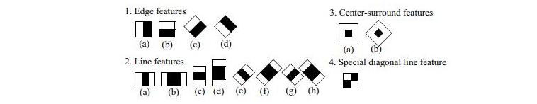
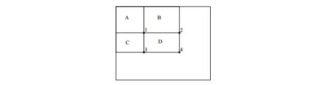
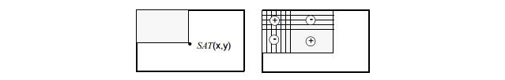
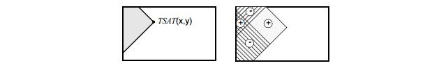

## 简介

Haar 特征[^1]是一种用于目标检测或识别的图像特征描述子，Haar 特征通常和 AdaBoost 分类器组合使用，而且由于 Haar 特征提取的实时性以及 AdaBoost 分类的准确率，使其成为人脸检测以及识别领域较为经典的算法。

## 多种Haar-like特征

在 Haar-like 特征[^2][^3]提出之前，传统的人脸检测算法一般是基于图像像素值进行的，计算量较大且实时性较差。 Papageorgiou 等人最早将 Harr 小波用于人脸特征表示，Viola 和 Jones 则在此基础上，提出了多种形式的 Haar 特征。Lienhart 等人对 Haar 矩形特征做了进一步的扩展，加入了旋转 $45^{\circ}$ 的矩形特征，因此现有的 Haar 特征模板主要如下图所示：

在计算 Haar 特征值时，用白色区域像素值的和减去黑色区域像素值的和，也就是说白色区域的权值为正值，黑色区域的权值为负值，而且权值与矩形区域的面积成反比，抵消两种矩形区域面积不等造成的影响，保证 Haar 特征值在灰度分布均匀的区域特征值趋近于 0 。Haar 特征在一定程度上反应了图像灰度的局部变化，在人脸检测中，脸部的一些特征可由矩形特征简单刻画，例如，眼睛比周围区域的颜色要深，鼻梁比两侧颜色要浅等。

Haar-like 矩形特征分为多类，特征模板可用于图像中的任一位置，而且大小也可任意变化，因此 Haar 特征的取值受到特征模板的类别、位置以及大小这三种因素的影响，使得在一固定大小的图像窗口内，可以提取出大量的 Haar 特征。例如，在一个 $24\times 24$ 的检测窗口内，矩形特征的数量可以达到 16 万个。这样就需要解决两个重要问题，快速计算 Haar 矩形特征值——积分图；筛选有效的矩形特征用于分类识别—— AdaBoost 分类器。

## 快速计算——积分图

### 积分图构建

在一个图像窗口中，可以提取出大量的 Haar 矩形特征区域，如果在计算 Haar 特征值时，每次都遍历矩形特征区域，将会造成大量重复计算，严重浪费时间。而积分图正是一种快速计算矩形特征的方法，其主要思想是将图像起始像素点到每一个像素点之间所形成的矩形区域的像素值的和，作为一个元素保存下来，也就是将原始图像转换为积分图 (或者求和图) ，这样在求某一矩形区域的像素和时，只需索引矩形区域 4 个角点在积分图中的取值，进行普通的加减运算，即可求得 Haar 特征值，整个过程只需遍历一次图像，计算特征的时间复杂度为常数 (O(1)) 。因此可以大大提升计算效率。

积分图中元素的公式定义如下：

$$
I_i(x,y) = \sum_{x'\leq x,y'\leq y} I(x',y')
$$

上式含义是在 $(x,y)$ (第 $x$ 行第 $y$ 列) 位置处，积分图中元素为原图像中对应像素左上角所有像素值之和。在具体实现时，可用下式进行迭代运算。

$$
s(x,y)=s(x,y-1)+I(x,y) \\
I_i(x,y)=I_i(x-1,y)+s(x,y)
$$

$s(x,y)$ 为行元素累加值，初始值 $s(x,-1)=0,I_i(-1,y)=0$ 。

#### 矩形特征计算
构建好积分图后，图像中任何矩形区域的像素值累加和都可以通过简单的加减运算快速得到，如下图所示，矩形区域 D 的像素和值计算公式如下： 

$$
Sum(D)=I_i(x_4, y_4)-I_i(x_2,y_2)-I_i(x_3,y_3)+I_i(x_1,y_1)
$$

在下图中，以水平向右为 x 轴正方向，垂直向下为 y 轴正方向，可定义积分图公式 Summed Area Table ($SAT(x,y)$ )

$$
SAT(x,y)=\sum_{x'\leq x,y'\leq y} I(x',y')
$$

以及迭代求解式对于左上角坐标为 $(x,y)$ ，宽高为 $(w,h)$ 的矩形区域 $r(x,y,w,h,0)$ ，可利用积分图 $SAT(x,y)$ 求取像素和值

$$
\scriptsize{
\begin{align*}
RecSum(r) &= SAT(x+w-1, y+h-1) \\ &+ SAT(x-1, y-1) \\ &- SAT(x+w-1, y-1) \\ &-SAT(x-1,y+h-1)
\end{align*}
}
$$

#### 旋转矩形特征的计算

对于旋转矩形特征，相应的有 $45^{\circ}$ 倾斜积分图用于快速计算 Haar 特征值，如下图所示，倾斜积分图的定义为像素点左上角 $45^{\circ}$ 区域和左下角 $45^{\circ}$ 区域的像素和，公式表示如下：

$$
RSAT(x,y)=\sum_{x'\leq x,x'\leq x-\left|y-y'\right|} I(x',y')
$$

其递推公式计算如下：

$$
\scriptsize{
RSAT(x,y)=RSAT(x-1,y-1)+RSAT(x-1,y)-RSAT(x-2,y-1)+I(x,y) \\
RSAT(x,y)=RSAT(x,y)+RSAT(x-1,y+1)-RSAT(x-2,y)
}
$$

其中 $RSAT(-1,y)=RSAT(-2,y)=RSAT(x,-1)=0$ 也可直接通过下式递归计算：

$$
\scriptsize{
RSAT(x,y)=RSAT(x-1,y-1)+RSAT(x+1,y-1)-RSAT(x,y-2)+I(x-1,y)+I(x,y)
}
$$

以上 3 个积分图计算公式是等价的。

如下图所示，构建好倾斜积分图后，可快速计算倾斜矩形区域$r=(x,y,w,h,45^{\circ})$的像素和值

$$
\scriptsize{
\begin{align*}
RecSum(r) &=RSAT(x+w-1,y+w-1) \\
&+RSAT(x-h-1,y+h-1) \\
&-RSAT(x-1,y-1) \\
&-RSAT(x+w-1-h,y+w-1+h)
\end{align*}
}
$$

## AdaBoost分类器

由输入图像得到积分图，通过取不同种类、大小的 Haar 特征模板，并在不同位置处，利用积分图提取 Haar 矩形特征，可快速得到大量Haar特征值，AdaBoost 分类器可用于对提取的 Haar 特征 (通常需要做归一化处理) 进行训练分类，并应用于人脸检测中。AdaBoost 是一种集成分类器，由若干个强分类级联而成，而每个强分类器又由若干个弱分类器 (例如：决策树) 组合训练得到。

弱分类器的定义如下：

$$
h_j(x)=\begin{cases} 1,&p_j f_j(x) < p_j \theta_j \\ 0, & otherwise \end{cases}
$$

上式中 $p_j$ 是为了控制不等式的方向而设置的参数。 $x$ 表示一个图像窗口，$f_j(x)$ 表示提取的 Haar 特征，阈值 $\theta$ 用于判断该窗口是否为目标区域 (人脸) 。

### 算法流程

- 假设训练样本为 $(x_i,y_i),i=0,1,...,n$，$y_i$ 取值为 0 (负样本)、1 (正样本)

- 初始化权重 $w_1,i=\dfrac{1}{2m},y_i=\dfrac{1}{2l}$ ，其中$m$表示负样本的个数，$l$表示正样本的个数

- For $t =1,2,...,T$ 

  1. 归一化权值：$w_{t,i} = \dfrac{w_{t,i}}{\Sigma_{j=1}^n w_{t,j}}$ 
  2. 对于每个(种)特征，训练一个分类器 ($h_j$) ，每个分类器只使用一种 Haar 特征进行训练。分类误差为 $\varepsilon_j = \sum_i w_i \left | h_j (x_i) - y_i \right|$ ， $h_j$ 为特征分类器，$x_i$ 为训练图像样本。
  3. 选择最低误差的分类器 $h_t$ 
  4. 更新训练样本的权值 $w_{t+1,i} = w_{t,i} \beta_t^{1-e_i}$，分类正确 $e_i=0$ ，分类错误 $e_i=1$ ， $\beta_t=\dfrac{\varepsilon_t}{1-\varepsilon_t}$ 

- 最后的强分类器为
  
    $$
    h(x)=\begin{cases} 1, & \sum_{t=1}^T \alpha_t h_t \geq \dfrac{1}{2} \Sigma_{t=1}^T \alpha_t \\ 0,& otherwise \end{cases}
    $$
    
    其中 $\alpha_t=log(\dfrac{1}{\beta_t})$ 。

在训练多个弱分类器得到强分类器的过程中，采用了两次加权的处理方法，一是对样本进行加权，在迭代过程中，提高错分样本的权重；二是对筛选出的弱分类器 $h_t$ 进行加权，弱分类器准确率越高，权重越大。此外，还需进一步对强分类器进行级联，以提高检测正确率并降低误识率。级联分类器如下所示：

首先将所有待检测的子窗口输入到第一个分类器中，如果某个子窗口判决通过，则进入下一个分类器继续检测识别，否则该子窗口直接退出检测流程，也就是说后续分类器不需要处理该子窗口。通过这样一种级联的方式可以去除一些误识为目标的子窗口，降低误识率。例如，单个强分类器，99% 的目标窗口可以通过，同时50%的非目标窗口也能通过，假设有 20 个强分类器级联，那么最终的正确检测率为 $0.99^{20}=98\%$ ，而错误识别率为 $0.50^{20} \approx 0.0001\%$ ，在不影响检测准确率的同时，大大降低了误识率。当然前提是单个强分类器的准确率非常高，这样级联多个分类器才能不影响最终的准确率或者影响很小。

在一幅图像中，为了能够检测到不同位置的目标区域，需要以一定步长遍历整幅图像；而对于不同大小的目标，则需要改变检测窗口的尺寸，或者固定窗口而缩放图像。这样，最后检测到的子窗口必然存在相互重叠的情况，因此需要进一步对这些重叠的子窗口进行合并，也就是非极大值抑制 (NMS, non-maximum suppression) ，同时剔除零散分布的错误检测窗口。

## 参考

[^1]: [Rapid Object Detection using a Boosted Cascade of Simple Features](http://wearables.cc.gatech.edu/paper_of_week/viola01rapid.pdf) 
[^2]: [Empirical Analysis of Detection Cascades of Boosted Classifiers for Rapid Object Detection](https://link.springer.com/content/pdf/10.1007%2F978-3-540-45243-0_39.pdf) 
[^3]: [Paper: An Extended Set of Haar-like Features for Rapid Object Detection](https://pdfs.semanticscholar.org/72e0/8cf12730135c5ccd7234036e04536218b6c1.pdf) 

[^4]: Senit_Co 博客: [图像特征提取之Haar特征](https://senitco.github.io/2017/06/15/image-feature-haar/) 

--8<--
mathjax.txt
--8<--