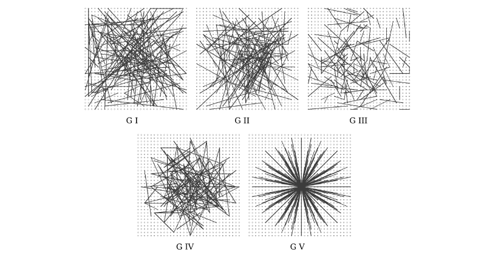

## ORB 算法原理

ORB (Oriented FAST and Rotated BRIEF)[^1] 算法是对 FAST 特征点检测和 BRIEF (Binary robust independent elementary features)[^2] 特征描述子的一种结合，在原有的基础上做了改进与优化，使得 ORB 特征具备多种局部不变性，并为实时计算提供了可能。

### 角点检测

ORB 首先利用 FAST 算法检测特征点，然后利用 Harris 角点的度量方式，从提取的 FAST 角点中筛选出 N 个 Harris 响应值最大的特征点，其中 Harris 角点的响应函数如下：

$$
R = \det M - \alpha (trace \, M)^2
$$

相关内容在前两篇文章「[Harris 角点检测](Harris.md)」和「[FAST 角点检测](FAST.md)」分别做了详细的介绍。

#### 旋转不变性

FAST 检测特征点不具备尺度不变性，可以借助尺度空间理论构建图像高斯金字塔，然后在每一层金字塔图像上检测角点，以实现尺度不变性。对于 FAST 特征点不具有方向，即不具备旋转不变性。原论文中提出了一种利用灰度质心法来解决这个问题，而带有方向的 FAST 角点被称为 oFAST 。灰度质心法假设灰度质心法假设角点的灰度与质心之间存在一个偏移，这个向量可以用于表示一个方向。换言之，在半径为 $r$ 的邻域内求取灰度质心，从特征点到灰度质心的向量，定义为该特征点的主方向。对于任意一个特征点 $p$ 来说，我们定义 $p$ 的邻域像素的矩为：

$$
m_{pq} = \sum_{x,y\in \bigcirc_r} x^p y^q I(x,y)
$$

其中 $I(x,y)$ 表示像素灰度值，$\bigcirc_r$ 是半径为 $r$ 离散化的 [Bresenham](https://en.wikipedia.org/wiki/Bresenham%27s_line_algorithm) 圆形窗口，零阶矩 $m_{00}$ 即图像领域窗口内所有像素的灰度和， $m_{10}$ 和 $m_{01}$ 分别是相对于 $x$ 与 $y$ 的一阶矩，因此图像局部邻域的中心矩或者质心可定义为：

$$
C = \left( \frac{m_{10}}{m_{00}} \,,\, \frac{m_{01}}{m_{00}} \right)
$$

则 oFAST 特征点的方向矢量定义为特征点的中心 $O$ 与质心 $C$ 形成的向量 $\overrightarrow{OC}$ 与 $X$ 轴的夹角，即：

$$
\theta = \arctan(m_{01}, m_{10})
$$

### 特征点描述

在介绍 ORB 对 BRIEF 特征描述子增添转向之前，我们先介绍下 BRIEF 特征描述子。它是一种对已检测到的特征点进行表示和描述的特征描述方法，和传统的利用图像局部邻域的灰度直方图或梯度直方图提取特征的方式不同，BRIEF 是一种二进制编码的特征描述子，既降低了存储空间的需求，提升了特征描述子生成的速度，也减少了特征匹配时所需的时间。

#### BRIEF 原理

经典的图像特征描述子 SIFT 和 SURF 采用 128 维 (SIFT) 或者 64 维 (SURF) 特征向量，每维数据一般占用 4 个字节 (Byte) ，一个特征点的特征描述向量需要占用 512 或者 256 个字节。如果一幅图像中包含有大量的特征点，那么特征描述子将占用大量的存储，而且生成描述子的过程也会相当耗时。在 SIFT 特征的实际应用中，可以采用 PCA 、LDA 等特征降维的方法来减少特征描述子的维度，例如 PCA-SIFT；此外还可以采用一些局部敏感哈希 (Locality-Sensitive Hashing, LSH) 的方法将特征描述子编码为二进制串，然后使用汉明距离 (Hamming Distance) 进行特征点的匹配，汉明距离计算的是两个二进制比特串中同一位置不同值的个数，可通过异或操作快速实现，大大提升了特征匹配的效率。

BRIEF 正是这样一种基于二进制编码生成特征描述子，以及利用汉明距离进行特征匹配的算法。由于 BRIEF 只是一种特征描述子，因此事先得检测并定位特征点，可采用 Harris、FAST 或者是 SIFT 算法检测特征点，在此基础上利用 BRIEF 算法建立特征描述符。该描述符是在特征点邻域 Patch 内随机选择若干点对 $(\mathbf{x},\mathbf{y})$ ，并比较这些点对的灰度值，灰度测试 $\tau$ 定义如下：

$$
\tau(p;\mathbf{x},\mathbf{y}) \doteq \begin{cases} 1 & p(\mathbf{x})<p(\mathbf{y}) \\ 0 & p(\mathbf{x}) \geq p(\mathbf{y}) \end{cases}
$$

式中 $p(\mathbf{x})$ 是图像块上点 $\mathbf{x} = (u,v)^\top$ 处的灰度值。所有的 $n$ 个点对进行比较，生成了一个 $n$ 长的二进制串：

$$
f_n(p) \doteq \sum_{1 \leq i \leq n} 2^{i-1} \tau(p; \mathbf{x}_i, \mathbf{y}_i)
$$

对于 $n$ 的取值可以设为 128 、 256 或者 512 。

#### BRIEF 算法实现

- 利用 FAST 或者 Harris 等方法进行角点检测
- 确定特征点邻域窗口 Patch ，并对该邻域内的像素进行高斯平滑滤除噪声
- 在邻域窗口内随机选取 $n = 128/256/512$ 对像素点，根据灰度值大小编码成二进制串，生成 $n$ bit 的特征描述子

#### BRIEF 点对选取

原论文作者 Calonder 提供了 5 种在 $S \times S$ 的邻域 Patch 内随机选取点对 $(\mathbf{x},\mathbf{y})$ 的方法。如下图所示，一条线段的两个端点表示一个随机点对 $(\mathbf{x}_i,\mathbf{y}_i)$ 。

1.  $\mathbf{x},\mathbf{y}$ 为均匀分布 $(-S/2, S/2)$ 
2.  $\mathbf{x},\mathbf{y}$ 为高斯分布 $\mathcal{N}(0,\frac{1}{25}S^2)$ 
3.  $\mathbf{x}$ 为高斯分布 $\mathcal{N}(0,\frac{1}{25}S^2)$ ， $\mathbf{y}$ 为高斯分布 $\mathcal{N}(0,\frac{1}{100}S^2)$ 
4. 在空间量化极坐标下的离散位置随机采样
5.  $\mathbf{x}_i$ 固定为 $(0,0)$ ， $\mathbf{y}$ 在周围平均采样

#### BRIEF 算法特点

BRIEF 算法通过检测随机响应，并采用二进制编码方式建立特征描述子，减少了特征的存储空间需求，并提升了特征生成的速度。Hamming 距离的度量方式便于进行特征点的快速匹配，而且大量实验数据表明，针对特征维数为 256 的情况，不匹配特征点的 Hamming 距离为 128 左右，而匹配点的 Hamming 距离则远小于 128 。

BRIEF 算法的缺点是不具备尺度不变性和旋转不变性，在图像的旋转角度超过 $30^\circ$ 时，特征点匹配的准确率快速下降。

#### BRIEF 特征描述子改进

根据上述，可知 BRIEF 虽然速度优势明显，但也存在一些缺陷，例如不具备尺度不变性和旋转不变性，对噪声敏感。尺度不变性的问题在利用 FAST 检测特征点时，通过构建高斯金字塔得以解决。BRIEF 中采用 9×9 的高斯卷积核进行滤波降噪，可以在一定程度上缓解噪声敏感问题。ORB 中利用积分图像，在 31×31 的 Patch 中选取随机点对，并以选取的随机点为中心，在 5×5 的窗口内计算灰度平均值（灰度和），比较随机点对的邻域灰度均值，进行二进制编码，而不是仅仅由两个随机点对的像素值决定编码结果，可以有效地解决噪声问题。

##### Steer BREIF

至于旋转不变性问题，可利用 FAST 特征点检测时求取的主方向，旋转特征点邻域，这种方法称为「Steer BREIF (sBRIEF) 」。但旋转整个 Patch 再提取 BRIEF 特征描述子的计算代价较大，因此，ORB 采用了一种更高效的方式，在每个特征点邻域 Patch 内，先选取 $n$ 对随机点，将其进行旋转，然后做判决编码为二进制串。 $n$ 个点对构成矩阵 $S$ 

$$
S = \begin{bmatrix} x_1 & x_2 & \dotsc & x_n \\ y_1 & y_2 & \dotsc & y_n \end{bmatrix}
$$

旋转矩阵 $R_\theta$ 为

$$
R_\theta =  \begin{bmatrix} \cos\theta & -\sin\theta \\ \sin\theta & \cos\theta \end{bmatrix}
$$

旋转后的坐标矩阵为

$$
S_\theta = R_\theta S
$$

##### rBRIEF

通过上述方法得到的特征描述子具有旋转不变性，但匹配效果却不如原始 BRIEF 算法，因为可区分性减弱了。特征描述子的一个要求就是要尽可能地表达特征点的独特性，便于区分不同的特征点。BRIEF 令人惊喜的特性之一是描述子所有比特位的均值接近于 0.5 ，且方差很大。方差越大表明可区分性越好，不同特征点的描述子表现出较大的差异性，不易造成误匹配。但 steered BRIEF 进行了坐标旋转，损失了这个特性，导致可区分性减弱，相关性变强，不利于匹配。

为了解决 steered BRIEF 可区分性降低的问题，ORB 使用了一种基于学习的方法来选择一定数量的随机点对。首先建立一个大约 $300k$ 特征点的数据集（特征点来源于 PASCAL2006 中的图像），对每个特征点，考虑其 31×31 的邻域 Patch ，为了去除噪声的干扰，选择 5×5 的子窗口的灰度均值代替单个像素的灰度，这样每个 Patch 内就有 $N = (31-5+1)\times(31-5+1) = 27 \times 27 = 729$ 个子窗口，从中随机选取 2 个非重复的子窗口，一共有 $M = C_N^2$ 种方法。这样，每个特征点便可提取出一个长度为 $M$ 的二进制串，所有特征点可构成一个 $300k \times M$ 的二进制矩阵 $Q$ ：

$$
Q = \begin{bmatrix} 
	p_{1,1} & p_{1,2} & \cdots & p_{1,M} \\
	p_{2,1} & p_{2,2} & \cdots & p_{2,M} \\
	\vdots & \vdots & \ddots & \vdots \\
	p_{300k,1} & p_{300k,2} & \cdots & p_{300k,M}
\end{bmatrix} \quad p_{i,j} \in \{0,1\}
$$

现在需要从 $M$ 个点对中选取 256 个相关性最小、可区分性最大的点对，作为最终的二进制编码。筛选方法如下：

1. 对矩阵 $Q$ 的每一列求取均值，并根据均值与 0.5 之间的距离从小到大的顺序，依次对所有列向量进行重新排序，得到矩阵 $T$ 
2. 将 $T$ 中的第一列向量放到结果矩阵 $R$ 中
3. 取出 $T$ 中的下一列向量，计算其与矩阵 $R$ 中所有列向量的相关性，如果相关系数小于给定阈值，则将 $T$ 中的该列向量移至矩阵 $R$ 中，否则丢弃
4. 循环执行上一步，直到 $R$ 中有 256 个列向量；如果遍历 $T$ 中所有列， $R$ 中向量列数还不满 256，则增大阈值，重复以上步骤

这样，最后得到的就是相关性最小的 256 对随机点，该方法称为 rBRIEF 。

## 参考

[^1]: Ethan Rublee, Vincent Rabaud, Kurt Konolige, Gary R. Bradski: [ORB: An efficient alternative to SIFT or SURFhttp](http://www.willowgarage.com/sites/default/files/orb_final.pdf)
[^2]:M. Calonder, V. Lepetit, C. Strecha, and P. Fua. [Brief: Binary robust independent elementary features](http://vision.stanford.edu/teaching/cs231b_spring1415/papers/BRIEF.pdf) 

[^3]: 思维之际博客：[BRIEF 特征描述子](https://www.cnblogs.com/ronny/p/4081362.html) 、[ORB特征点检测](https://www.cnblogs.com/ronny/p/4083537.html) 

[^4]: Senit_Co 博客：[图像特征描述子之ORB](https://senitco.github.io/2017/07/09/image-feature-orb/)  、[图像特征描述子之BRIEF](https://senitco.github.io/2017/07/05/image-feature-brief/)

--8<--
mathjax.txt
--8<--