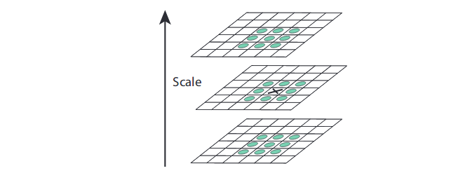
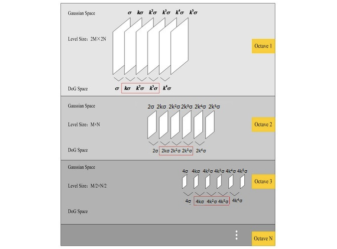

## 简介

尺度不变特征变换 (Scale-invariant feature transform, SIFT) [^1][^2] 是计算机视觉中一种检测、描述和匹配图像局部特征点的方法，通过在不同的尺度空间中检测极值点或特征点 (Conrner Point, Interest Point) ，提取出其位置、尺度和旋转不变量，并生成特征描述子，最后用于图像的特征点匹配。SIFT 特征凭借其良好的性能广泛应用于运动跟踪 (Motion tracking) 、图像拼接 (Automatic mosaicing) 、3D 重建 (3D reconstruction) 、移动机器人导航 (Mobile robot navigation) 以及目标识别 (Object Recognition) 等领域。

## 尺度空间极值检测

为了使检测到的特征点具备尺度不变性，使能够在不同尺度检测到尽可能完整的特征点或关键点，则需要借助尺度空间理论来描述图像的多尺度特征。相关研究证明高斯卷积核是实现尺度变换的唯一线性核。因此可用图像的高斯金字塔表示尺度空间，而且尺度规范化的 LoG 算子具有尺度不变性，在具体实现中，可用高斯差分 (DoG) 算子近似 LoG 算子，在构建的尺度空间中检测稳定的特征点。

### 构建尺度空间

尺度空间理论的基本思想是：在图像处理模型中引入一个被视为尺度的参数，通过连续变化尺度参数获取多尺度下的空间表示序列，对这些空间序列提取某些特征描述子，抽象成特征向量，实现图像在不同尺度或不同分辨率的特征提取。尺度空间中各尺度图像的模糊程度逐渐变大，模拟人在由近到远时目标在人眼视网膜上的成像过程。而且尺度空间需满足一定的不变性，包括图像灰度不变性、对比度不变性、平移不变性、尺度不变性以及旋转不变性等。在某些情况下甚至要求尺度空间算子具备仿射不变性。

图像的尺度空间 $L(x,y,\sigma)$ 可以定义为输入图像 $I(x,y)$ 与可变尺度的高斯函数 $G(x,y,\sigma)$ 进行卷积：

$$
L(x,y,\sigma) = G(x,y,\sigma) * I(x,y) \\
G(x,y,\sigma) = \frac{1}{2\pi\sigma^2}e^{-\frac{x^2+y^2}{2\sigma^2}}
$$

式中， $(x,y)$ 是图像的空间坐标，高斯函数 $G(x,y,\sigma)$ 中的 $\sigma$ 是尺度坐标 (尺度变化因子) ， $\sigma$ 大小决定图像的平滑程度，值越大图像模糊得越严重。大尺度对应图像的概貌特征，小尺度对应图像的细节特征。一般根据 $3\sigma$ 原则，高斯核矩阵的大小设为 $(6\sigma+1)\times(6\sigma+1)$ 。

在使用高斯金字塔构建尺度空间时，主要分成两部分，对图像做降采样，以及对图像做不同尺度的高斯模糊。对图像做降采样得到不同尺度的图像，也就是不同的组 (Octave) ，后面的 Octave (高一层的金字塔) 为上一个 Octave (低一层的金字塔) 降采样得到，图像宽高分别为上一个 Octave 的 $1/2$ 。每组 (Octave) 又分为若干层 (Interval) ，通过对图像做不同尺度的高斯模糊得到。为了有效地在尺度空间检测稳定的关键点，提出了高斯差分尺度空间 (Difference-of-Gaussian (DoG) Scale-Space) $D(x,y,\sigma)$ ， $D(x,y,\sigma)$ 可以通过由变化尺度因子 $k$ 分隔的相邻不同尺度的高斯差分核与图像卷积生成：

$$
\begin{align*}
D(x,y,\sigma) &= \left( G(x,y,k\sigma) - G(x,y,\sigma) \right) * I(x,y) \\
&= L(x,y,k\sigma) - L(x,y,\sigma)
\end{align*}
$$

图像的高斯金字塔和高斯差分金字塔如下图所示，高斯差分图像由高斯金字塔中同一组 (Octave) 内相邻层 (Interval) 的图像作差得到。

### 尺度空间的参数确定

在由图像金字塔表示的尺度空间中，图像的 Octave 由原始图像的大小和塔顶图像的大小决定。

$$
Octave = \log_2(\min(width_0,height_0)) - \log_2(\min(width,height))
$$

其中， $width_0, \, height_0$ 分别为原始图像的宽和高， $width, \, height$ 分别为金字塔塔顶图像的宽和高。例如：对于一幅大小为 512×512 的图像，当塔顶图像大小为 4×4 时，图像的组数为 $Octave=7$ 。

尺度参数 $\sigma$ 的取值与金字塔的组数和层数相关，设第一组第一层的尺度参数取值为 $\sigma(1,1) = \sigma_0$ ，一般 $\sigma_0$ 取 $1.6$ 。则第 $m$ 组第 $n$ 层的 $\sigma(m,n)$ 取值为

$$
\sigma(m,n) = \sigma_0 \cdot 2^{m-1} \cdot k^{n-1}, \quad k=2^\frac{1}{S}
$$

式中， $S$ 是金字塔中每组的有效层数，$k=2^\frac{1}{S}$ 是变化尺度因子。在检测极值点前对原始图像的高斯平滑会导致图像高频信息的丢失，所以在建立尺度空间之前，先利用双线性插值将图像扩大为原来的两倍，以保留原始图像信息，增加特征点数量。

#### 第一组第一层图像的生成

根据上述说明，为了得到更多的特征点，需要将图像扩大为原来的两倍。根据图像反走样的需要，通常假设输入图像 $I(x,y)$ 是经过高斯平滑处理的，其值为 $\sigma' = 0.5$ ，即半个像元。意思就是说我们采集到的图像 $I(x,y)$ ，已经被 $\sigma' = 0.5$ 的高斯滤波器平滑过了。那么，经过双线性插值扩大为原来的两倍后的图像 $I'(x,y)$ 可以看为是被 $2\sigma' = 1$ 高斯平滑处理过的。所以我们不能直接对扩大两倍后的图像 $I'(x,y)$ 直接用 $\sigma_0 = 1.6$ 的高斯滤波器平滑，而应该用 $\sqrt{\sigma_0^2 - (2\sigma'^2)}$ 的高斯滤波器去平滑图像 $I'(x,y)$ ，即：

$$
I_{pyr(1,1)}(x,y) = I'(x,y) * G(x,y,\sqrt{\sigma_0^2 - (2\sigma'^2)})
$$

### 局部极值检测

为了寻找 DoG 尺度空间的极值点，每一个采样点要和其所有邻域像素相比较，如下图所示，中间检测点与其同尺度的 8 个邻域像素点以及上下相邻两层对应的 9×2 个像素点一共 26 个点作比较，以确保在图像空间和尺度空间都能检测到极值点。一个像素点如果在 DoG 尺度空间本层及上下两层的 26 邻域中取得最大或最小值时，就可以认为该点是图像在该尺度下的一个特征点。

#### 每组尺度空间需要的层数

如上所述，在极值比较的过程中，每一组差分图像的首末两层是无法比较的，为了在每组中检测 $S$ 个尺度的极值点，则DoG金字塔每组须有 $S+2$ 层图像，高斯金字塔每组须有 $S+3$ 层图像。另外，在降采样时，高斯金字塔中后一组 (Octive) 的底层图像是由前一组图像的倒数第 $3$ 张图像 ( $S+1$ 层) 隔点采样得到。这样也保证了尺度变化的连续性，如下图所示：

根据上图，假设每组层数 $S=3$ ，则 $k=2^\frac{1}{S} = 2^\frac{1}{3}$ ，在高斯金字塔中，第一个 Octave 第 $S+1$ 层图像的尺度为 $k^3\sigma = 2\sigma$ ，经降采样后得到第二个 Octave 的第 1 层图像，尺度仍为 $2\sigma$ 。在 DoG 尺度空间中，第一组 (1st-Octave) 图像中间三项的尺度分别为 $(k\sigma, k^2\sigma, k^3\sigma)$ ，下一组中间三项为 $(2k\sigma, 2k^2\sigma, 2k^3\sigma)$ ，其 “首项” $2k\sigma = 2^\frac{4}{3}$ ，与 上一组 “末项” $k^3\sigma = 2^\frac{3}{3}\sigma$ 尺度变化连续，变化尺度为 $k=2^\frac{1}{S} = 2^\frac{1}{3}$ 。

## 关键点定位

在 DoG 尺度空间检测到的极值点是离散的，通过拟合三元二次函数可以精确定位关键点的位置和尺度，达到亚像素精度。同时去除低对比度的检测点和不稳定的边缘点，以增强匹配稳定性，提高抗噪声能力。

## 参考

[^1]: [Distinctive Image Features from Scale-Invariant Keypoints](https://www.cs.ubc.ca/~lowe/papers/ijcv04.pdf) 
[^2]: [Object Recognition from Local Scale-Invariant Features](http://cgit.nutn.edu.tw:8080/cgit/PaperDL/iccv99.pdf) 
[^3]: Slides : [Object Recognition from Local Scale-Invariant Feature](https://people.cs.umass.edu/~elm/Teaching/ppt/SIFT.pdf) 
[^4]: Senit_Co 博客：[图像特征之SIFT特征匹配](https://senitco.github.io/2017/06/24/image-feature-sift/) 
[^5]: 思维之际博客：[SIFT定位算法关键步骤的说明](https://www.cnblogs.com/ronny/p/4028776.html)

--8<--
mathjax.txt
--8<--