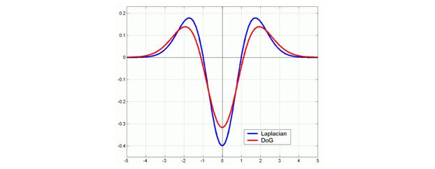
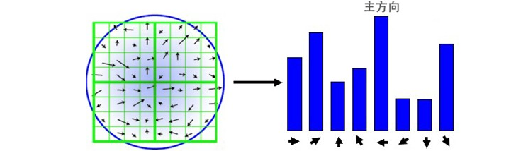

## 简介

尺度不变特征变换 (Scale-invariant feature transform, SIFT) [^1][^2] 是计算机视觉中一种检测、描述和匹配图像局部特征点的方法，通过在不同的尺度空间中检测极值点或特征点 (Conrner Point, Interest Point) ，提取出其位置、尺度和旋转不变量，并生成特征描述子，最后用于图像的特征点匹配。SIFT 特征凭借其良好的性能广泛应用于运动跟踪 (Motion tracking) 、图像拼接 (Automatic mosaicing) 、3D 重建 (3D reconstruction) 、移动机器人导航 (Mobile robot navigation) 以及目标识别 (Object Recognition) 等领域。

## 尺度空间极值检测

为了使检测到的特征点具备尺度不变性，使能够在不同尺度检测到尽可能完整的特征点或关键点，则需要借助尺度空间理论来描述图像的多尺度特征。相关研究证明高斯卷积核是实现尺度变换的唯一线性核。因此可用图像的高斯金字塔表示尺度空间，而且尺度规范化的 LoG 算子具有尺度不变性，在具体实现中，可用高斯差分 (DoG) 算子近似 LoG 算子，在构建的尺度空间中检测稳定的特征点。

### 构建尺度空间

尺度空间理论的基本思想是：在图像处理模型中引入一个被视为尺度的参数，通过连续变化尺度参数获取多尺度下的空间表示序列，对这些空间序列提取某些特征描述子，抽象成特征向量，实现图像在不同尺度或不同分辨率的特征提取。尺度空间中各尺度图像的模糊程度逐渐变大，模拟人在由近到远时目标在人眼视网膜上的成像过程。而且尺度空间需满足一定的不变性，包括图像灰度不变性、对比度不变性、平移不变性、尺度不变性以及旋转不变性等。在某些情况下甚至要求尺度空间算子具备仿射不变性。

#### 尺度空间的表示

图像的尺度空间 $L(x,y,\sigma)$ 可以定义为输入图像 $I(x,y)$ 与可变尺度的高斯函数 $G(x,y,\sigma)$ 进行卷积：

$$
L(x,y,\sigma) = G(x,y,\sigma) * I(x,y) \\
G(x,y,\sigma) = \frac{1}{2\pi\sigma^2}e^{-\frac{x^2+y^2}{2\sigma^2}}
$$

式中， $(x,y)$ 是图像的空间坐标，高斯函数 $G(x,y,\sigma)$ 中的 $\sigma$ 是尺度坐标 (尺度变化因子) ， $\sigma$ 大小决定图像的平滑程度，值越大图像模糊得越严重。大尺度对应图像的概貌特征，小尺度对应图像的细节特征。一般根据 $3\sigma$ 原则，高斯核矩阵的大小设为 $(6\sigma+1)\times(6\sigma+1)$ 。

在使用高斯金字塔构建尺度空间时，主要分成两部分，对图像做降采样，以及对图像做不同尺度的高斯模糊。对图像做降采样得到不同尺度的图像，也就是不同的组 (Octave) ，后面的 Octave (高一层的金字塔) 为上一个 Octave (低一层的金字塔) 降采样得到，图像宽高分别为上一个 Octave 的 $1/2$ 。每组 (Octave) 又分为若干层 (Interval) ，通过对图像做不同尺度的高斯模糊得到。

#### 高斯差分金字塔

在 2002 年 [Mikolajczyk](http://lear.inrialpes.fr/people/mikolajczyk/) 在详细的实验比较中发现尺度归一化的高斯拉普拉斯函数 $\sigma^2 \nabla^2G$ 的极大值和极小值同其它特征提起函数（例如：梯度、Hessian 或者 Harris 角点）比较，能够产生最为稳定的图像特征。而早在 1994 年 Lindebery 发现高斯差分函数（Difference-of-Gaussian ，简称 DoG 算子）与尺度归一化的高斯拉普拉斯函数 $\sigma^2 \nabla^2G$ 非常近似。其中两者间的关系可以从如下推导得到：

$$
\frac{\partial G}{\partial \sigma} = \sigma \nabla^2 G
$$

利用差分近似替代微分，则有：

$$
\sigma \nabla^2 G = \frac{\partial G}{\partial \sigma} \approx \frac{G(x,y,k\sigma) - G(x,y,\sigma)}{k\sigma -\sigma}
$$

因此有：

$$
G(x,y,k\sigma) - G(x,y,\sigma) \approx (k-1)\sigma^2 \nabla^2 G
$$

其中， $k-1$ 是个常数，不影响极值点的检测，如下图所示，红色曲线表示的是高斯差分算子，而蓝色曲线表示的是高斯拉普拉斯算子。

为了能更为高效地在尺度空间检测稳定的关键点，SIFT 作者选用了高斯差分算子替代高斯拉普拉斯算子。因此提出了高斯差分尺度空间 (Difference-of-Gaussian Scale-Space) $D(x,y,\sigma)$ ， $D(x,y,\sigma)$ 可以通过由变化尺度因子 $k$ 分隔的相邻不同尺度的高斯差分核与图像卷积生成：

$$
\begin{align*}
D(x,y,\sigma) &= \left( G(x,y,k\sigma) - G(x,y,\sigma) \right) * I(x,y) \\
&= L(x,y,k\sigma) - L(x,y,\sigma)
\end{align*}
$$

图像的高斯金字塔和高斯差分金字塔如下图所示，高斯差分图像由高斯金字塔中同一组 (Octave) 内相邻层 (Interval) 的图像作差得到。

### 尺度空间的参数确定

在由图像金字塔表示的尺度空间中，图像的 Octave 由原始图像的大小和塔顶图像的大小决定。

$$
Octave = \log_2(\min(width_0,height_0)) - \log_2(\min(width,height))
$$

其中， $width_0, \, height_0$ 分别为原始图像的宽和高， $width, \, height$ 分别为金字塔塔顶图像的宽和高。例如：对于一幅大小为 512×512 的图像，当塔顶图像大小为 4×4 时，图像的组数为 $Octave=7$ 。

尺度参数 $\sigma$ 的取值与金字塔的组数和层数相关，设第一组第一层的尺度参数取值为 $\sigma(1,1) = \sigma_0$ ，一般 $\sigma_0$ 取 $1.6$ 。则第 $m$ 组第 $n$ 层的 $\sigma(m,n)$ 取值为

$$
\sigma(m,n) = \sigma_0 \cdot 2^{m-1} \cdot k^{n-1}, \quad k=2^\frac{1}{S}
$$

式中， $S$ 是金字塔中每组的有效层数，$k=2^\frac{1}{S}$ 是变化尺度因子。在检测极值点前对原始图像的高斯平滑会导致图像高频信息的丢失，所以在建立尺度空间之前，先利用双线性插值将图像扩大为原来的两倍，以保留原始图像信息，增加特征点数量。

#### 第一组第一层图像的生成

根据上述说明，为了得到更多的特征点，需要将图像扩大为原来的两倍。根据图像反走样的需要，通常假设输入图像 $I(x,y)$ 是经过高斯平滑处理的，其值为 $\sigma' = 0.5$ ，即半个像元。意思就是说我们采集到的图像 $I(x,y)$ ，已经被 $\sigma' = 0.5$ 的高斯滤波器平滑过了。那么，经过双线性插值扩大为原来的两倍后的图像 $I'(x,y)$ 可以看为是被 $2\sigma' = 1$ 高斯平滑处理过的。所以我们不能直接对扩大两倍后的图像 $I'(x,y)$ 直接用 $\sigma_0 = 1.6$ 的高斯滤波器平滑，而应该用 $\sqrt{\sigma_0^2 - (2\sigma'^2)}$ 的高斯滤波器去平滑图像 $I'(x,y)$ ，即：

$$
I_{pyr(1,1)}(x,y) = I'(x,y) * G(x,y,\sqrt{\sigma_0^2 - (2\sigma'^2)})
$$

### 局部极值检测

为了寻找 DoG 尺度空间的极值点，每一个采样点要和其所有邻域像素相比较，如下图所示，中间检测点与其同尺度的 8 个邻域像素点以及上下相邻两层对应的 9×2 个像素点一共 26 个点作比较，以确保在图像空间和尺度空间都能检测到极值点。一个像素点如果在 DoG 尺度空间本层及上下两层的 26 邻域中取得最大或最小值时，就可以认为该点是图像在该尺度下的一个特征点。

#### 每组尺度空间需要的层数

如上所述，在极值比较的过程中，每一组差分图像的首末两层是无法比较的，为了在每组中检测 $S$ 个尺度的极值点，则DoG金字塔每组须有 $S+2$ 层图像，高斯金字塔每组须有 $S+3$ 层图像。另外，在降采样时，高斯金字塔中后一组 (Octive) 的底层图像是由前一组图像的倒数第 $3$ 张图像 ( $S+1$ 层) 隔点采样得到。这样也保证了尺度变化的连续性，如下图所示：

根据上图，假设每组层数 $S=3$ ，则 $k=2^\frac{1}{S} = 2^\frac{1}{3}$ ，在高斯金字塔中，第一个 Octave 第 $S+1$ 层图像的尺度为 $k^3\sigma = 2\sigma$ ，经降采样后得到第二个 Octave 的第 1 层图像，尺度仍为 $2\sigma$ 。在 DoG 尺度空间中，第一组 (1st-Octave) 图像中间三项的尺度分别为 $(k\sigma, k^2\sigma, k^3\sigma)$ ，下一组中间三项为 $(2k\sigma, 2k^2\sigma, 2k^3\sigma)$ ，其 “首项” $2k\sigma = 2^\frac{4}{3}$ ，与 上一组 “末项” $k^3\sigma = 2^\frac{3}{3}\sigma$ 尺度变化连续，变化尺度为 $k=2^\frac{1}{S} = 2^\frac{1}{3}$ 。

## 关键点定位

在 DoG 尺度空间检测到的极值点是离散的，通过拟合三元二次函数可以精确定位关键点的位置和尺度，达到亚像素精度。同时去除低对比度的检测点和不稳定的边缘点 (因为 DoG 算子会产生较强的边缘响应) ，以增强匹配稳定性，提高抗噪声能力。

### 关键点精确定位

离散空间的极值点并不是真正的极值点，如下图所示一维函数离散空间得到的极值点与连续空间极值点的差别。利用已知的离散空间点插值得到的连续空间极值点的方法叫做子像素插值 (Sub-pixel Interpolation) 

下面我们用子像素插值法来考虑连续区间上的情况，假设我们在尺度为 $\sigma$ 的尺度图像 $D(x,y,\sigma)$ 检测到一个局部极值点，空间位置为 $(x,y,\sigma)$ 。根据上图直观可知，它只是离散情况下的极值点，而连续情况下，极值点可能坐落在 $(x,y,\sigma)$ 的附近，设连续情况的正真极值点偏离 $(x,y,\sigma)$ 的坐标为 $(\Delta x, \Delta y, \Delta \sigma)$ 。则对于正真极值点 $D(x+\Delta x, y+\Delta y, \sigma+\Delta \sigma)$ 可以在尺度空间 $D(x,y,\sigma)$ 处进行泰勒展开（依照 $f(x+\Delta x) \approx f(x) + f'(x)\Delta x + f''(x)\Delta x^2$ 保留二阶形式）：

$$
\scriptsize {
D(x+\Delta x, y+\Delta y, \sigma+\Delta \sigma) \approx \\ \quad
D(x,y,\sigma) 
+ \begin{bmatrix} \frac{\partial D}{\partial x} & \frac{\partial D}{\partial y} & \frac{\partial D}{\partial \sigma} \end{bmatrix}
\begin{bmatrix} \Delta x \\ \Delta y \\ \Delta \sigma \end{bmatrix} 
+ \frac{1}{2} \begin{bmatrix} \Delta x & \Delta y & \Delta \sigma \end{bmatrix} 
\begin{bmatrix} \frac{\partial D^2}{\partial x^2} & \frac{\partial D^2}{\partial x \partial y} & \frac{\partial^2 D}{\partial x \partial \sigma} \\ \frac{\partial D^2}{\partial y \partial x} & \frac{\partial D^2}{\partial y^2} & \frac{\partial D^2}{\partial y \partial \sigma} \\ \frac{\partial D^2}{\partial \sigma \partial x} & \frac{\partial D^2}{\partial \sigma \partial y} & \frac{\partial D^2}{\partial \sigma^2} \end{bmatrix}
\begin{bmatrix} \Delta x \\ \Delta y \\ \Delta \sigma \end{bmatrix}
}
$$

可以将上式写成矢量形式，得：

$$
D(X+\Delta X) = D(X) + \frac{\partial D^\top(X)}{\partial X} \Delta X + \frac{1}{2} \Delta X^\top \frac{\partial^2D(X)}{\partial X^2} \Delta X
$$

上式对 $\Delta X$ 求导，并令其等于零，可以得到极值点的偏移量：

$$
\Delta X = - \frac{\partial^2D(X)}{\partial X^2}^{-1} \frac{\partial D^\top(X)}{\partial X}
$$

当它在任一维度上 (即 $x$ 或 $y$ 或 $\sigma$ ）的偏移量大于 0.5 时，意味着插值中心已经偏移到它的邻近点上，所以必须改变当前关键点的位置。同时在新的位置上反复插值直到收敛，也有可能超出所设定的迭代次数或者超出图像边界的范围，此时这样的点应该删除。精确关键点处的函数值为：

$$
D(\hat{X}) = D(X) + \frac{1}{2} \frac{\partial D^\top(X)}{\partial X} \Delta X
$$

如果 $|D(\hat{X})|$ 过小易受噪声点的干扰而变得不稳定，若其小于某个阈值 (例如 0.03 或者 0.04/S ) ，则将该极值点也应该删除。

### 消除边缘响应

高斯差分函数有较强的边缘响应，对于比较像边缘的点应该去除掉。这样的点的特征为在某个方向有较大主曲率，而在垂直的方向主曲率很小。主曲率可通过一个 2×2 的 Hessian 矩阵求出

$$
H = \begin{bmatrix} D_{xx} & D_{xy} \\ D_{xy} & D_{yy} \end{bmatrix}
$$

$D$ 的主曲率和 $H$ 的特征值成正比，令 $\alpha$ 为较大特征值， $\beta$ 为较小特征值，且令 $\alpha / \beta = r$ ，则

$$
tr(H) = D_{xx}+D_{yy} = \alpha + \beta \;, \quad \det(H) = D_{xx}D_{yy}-D_{xy}^2 = \alpha \beta \\
\frac{tr(H)^2}{\det(H)} = \frac{(\alpha + \beta)^2}{\alpha \beta} = \frac{(r+1)^2}{r}
$$

$(r+1)^2 /  r$ 在两个特征值相等时最小，随着 $r$ 的增大而增大， $r$ 值越大，说明两个特征值的比值越大，正好对应边缘的情况。因此，设定一个阈值 $r_t$ ，若满足

$$
\frac{tr(H)^2}{\det(H)} < \frac{(r_t + 1)^2}{r_t}
$$

则认为该关键点不是边缘，否则予以剔除。

## 关键点方向指定

为了使特征描述子具有旋转不变性，需要利用关键点邻域像素的梯度方向分布特性为每个关键点指定方向参数。对于在 DoG 金字塔中检测出的关键点，在其邻近高斯金字塔图像的 $3\sigma$ 邻域窗口内计算其梯度幅值和方向，公式如下：

$$
m(x,y) = \sqrt{\left(L(x+1,y) - L(x-1,y)\right)^2 + \left(L(x,y+1) - L(x,y-1)\right)^2} \\
\theta(x,y) = \arctan \left( (L(x,y+1) - L(x,y-1)) / (L(x+1,y) - L(x-1,y)) \right)
$$

式中，$L$ 为关键点所在尺度空间的灰度值，$m(x,y)$ 为梯度幅值，$\theta(x,y)$ 为梯度方向。对于模值 $m(x,y)$ 按照 $\sigma = 1.5 \sigma_{oct}$ 邻域窗口为 $3\sigma = 3 \times 1.5 \sigma_{oct}$ 的高斯分布加权。在完成关键点的梯度计算后，使用直方图统计邻域内像素的梯度和方向，梯度直方图将梯度方向 $(0,360^\circ)$ 分为 36 柱 (bins) ，如下图所示 (为简化，图中只画了八个方向的直方图) ，直方图的峰值所在的方向代表了该关键点的主方向。

梯度方向直方图的峰值代表了该特征点处邻域梯度的主方向，为了增强鲁棒性，保留峰值大于主方向峰值 80% 的方向作为该关键点的辅方向，因此，在相同位置和尺度，将会有多个关键点被创建但方向不同，可以提高特征点匹配的稳定性。

至此，将检测出的含有位置、尺度和方向的关键点即是该图像的SIFT特征点。

## 关键点特征描述子

在经过上述流程后，检测到的每个关键点有三个信息：位置、尺度以及方向，接下来就是为每个关键点建立一个描述符，用一组向量将这个关键点描述出来。这个特征描述子不但包括关键点，还包括其邻域像素的贡献，而且需具备较高的独特性和稳定性，以提高特征点匹配的准确率。SIFT 特征描述子是关键点邻域梯度经过高斯加权后统计结果的一种表示。通过对关键点周围图像区域分块，计算块内的梯度直方图，得到表示局部特征点信息的特征向量。例如在尺度空间 4×4 的窗口内统计 8 个方向的梯度直方图，生成一个 4×4×8=128 维的表示向量。

### 确定计算描述子所需的图像区域

### 向量归一化生成描述子

得到 128 维特征向量后，为了去除光照变化的影响，需要对向量进行归一化处理。非线性光照变化仍可能导致梯度幅值的较大变化，但对梯度方向影响较小。因此对于超过阈值 0.2 的梯度幅值设为 0.2 ，然后再进行一次归一化。最后将特征向量按照对应高斯金字塔的尺度大小排序。至此，SIFT 特征描述子形成。

### SIFT 特征匹配

对两幅图像中检测到的特征点，可采用特征向量的欧式距离作为特征点相似性的度量，取图像 1 中某个关键点，并在图像 2 中找到与其距离最近的两个关键点，若最近距离与次近距离的比值小于某个阈值，则认为距离最近的这一对关键点为匹配点。降低比例阈值，SIFT 匹配点数量会减少，但相对而言会更加稳定。阈值 ratio 的取值范围一般为 0.4~0.6 。

## SIFT特征的特点

SIFT是一种检测、描述、匹配图像局部特征点的算法，通过在尺度空间中检测极值点，提取位置、尺度、旋转不变量，并抽象成特征向量加以描述，最后用于图像特征点的匹配。SIFT特征对灰度、对比度变换、旋转、尺度缩放等保持不变性，对视角变化、仿射变化、噪声也具有一定的鲁棒性。但其实时性不高，对边缘光滑的目标无法准确提取特征点。

## 参考

[^1]: [Distinctive Image Features from Scale-Invariant Keypoints](https://www.cs.ubc.ca/~lowe/papers/ijcv04.pdf) 
[^2]: [Object Recognition from Local Scale-Invariant Features](http://cgit.nutn.edu.tw:8080/cgit/PaperDL/iccv99.pdf) 
[^3]: Slides : [Object Recognition from Local Scale-Invariant Feature](https://people.cs.umass.edu/~elm/Teaching/ppt/SIFT.pdf) 
[^4]: zddhub 博客：[SIFT 算法详解](https://blog.csdn.net/zddblog/article/details/7521424) (论文中包含**有限差分求导推导** 、**三阶矩阵求逆**)
[^5]: Senit_Co 博客：[图像特征之SIFT特征匹配](https://senitco.github.io/2017/06/24/image-feature-sift/) 
[^6]: 思维之际博客：[SIFT定位算法关键步骤的说明](https://www.cnblogs.com/ronny/p/4028776.html)

--8<--
mathjax.txt
--8<--