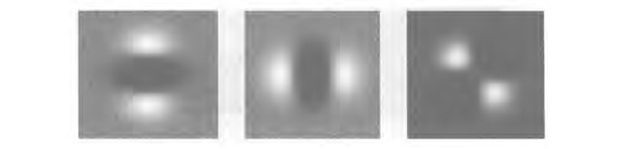
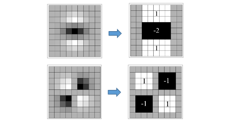
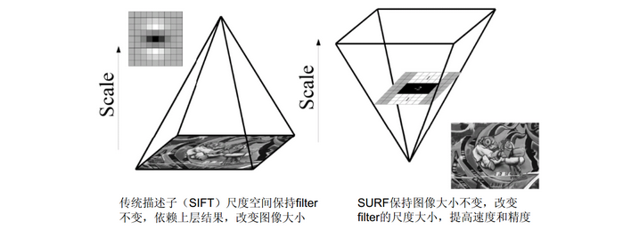
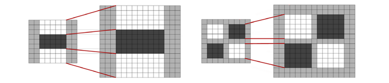
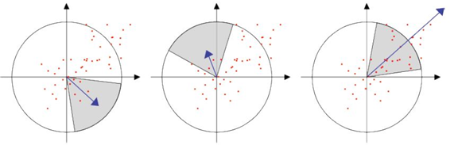
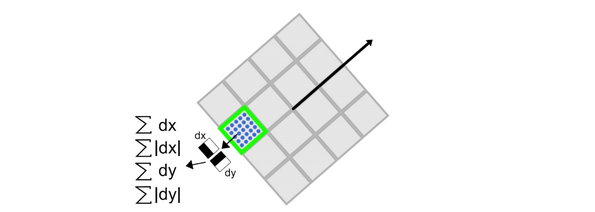
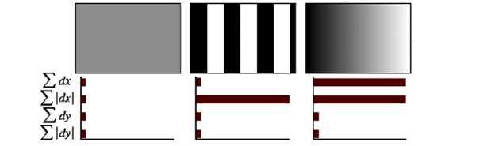

## 简介

加速鲁棒特征 (Speed Up Robust Feature, SURF) [^1][^2] 和 SIFT 特征类似，同样是一个用于检测、描述、匹配图像局部特征点的特征描述子。SIFT 是被广泛应用的特征点提取算法，但其实时性较差，如果不借助于硬件的加速和专用图形处理器 (GPUs) 的配合，很难达到实时的要求。对于一些实时应用场景，如基于特征点匹配的实时目标跟踪系统，每秒要处理数十帧的图像，需要在毫秒级完成特征点的搜索定位、特征向量的生成、特征向量的匹配以及目标锁定等工作，SIFT 特征很难满足这种需求。SURF 借鉴了 SIFT 中近似简化 (DoG 近似替代 LoG) 的思想，将 Hessian 矩阵的高斯二阶微分模板简化，使得模板对图像的滤波只需要进行几次简单的加减法运算，并且这种运算与滤波模板的尺寸无关。SURF 相当于 SIFT 的加速改进版本，在特征点检测取得相似性能的条件下，提高了运算速度。整体来说，SURF 比 SIFT 在运算速度上要快数倍，综合性能更优。

## SURF 特征提取

### 积分图像

SURF 算法中用到了积分图的概念，积分图 (Integral Image) 由 Viola 和 Jones 提出，在博文「 [Haar 特征提取](Haar.md)」中做了详细的介绍，这里就不重复。借助积分图，图像与高斯二阶微分模板的滤波转化为对积分图像的加减运算，从而在特征点的检测时大大缩短了搜索时间。

### Hessian 矩阵近似

SIFT算法建立一幅图像的金字塔，在每一层进行高斯滤波并求取图像差 (DoG) 进行特征点的提取，而 SURF 则用的是 Hessian 矩阵近似进行特征点的提取。图像点的二阶微分 Hessian 矩阵的行列式 (Determinant of Hessian, DoH) 极大值，可用于图像的斑点检测 (Blob Detection) 。由于特征点需要尺度无关性，所以在进行 Hessian 矩阵构造前，需要对其进行高斯滤波。Hessian-Laplace detector 矩阵定义如下：

$$
H(x,y,\sigma) = \begin{bmatrix} L_{xx} & L_{xy} \\ L_{xy} & L_{yy} \end{bmatrix}
$$

式中， $L_{xx}$ 、 $L_{yy}$ 和 $L_{xy}$ 分别是高斯二阶偏导算子 $\frac{\partial^2 g}{\partial x^2}$ 、 $\frac{\partial^2 g}{\partial y^2}$ 和 $\frac{\partial^2 g}{\partial x \partial y}$ 与原图像的卷积，该矩阵的行列式 DoH 为：

$$
\det(H) = L_{xx} L_{yy} - L_{xy}^2
$$

与 LoG 算子一样，DoH 同样反映了图像局部的纹理或结构信息，与 LoG 相比，DoH 对图像中细长结构的斑点有较好的抑制作用。LoG 和 DoH 在利用二阶微分算子对图像进行斑点检测时，都需要利用高斯滤波平滑图像、抑制噪声，检测过程主要分为以下两步：

- 使用不同的 $\sigma$ 生成 $\left( \frac{\partial^2 g}{\partial x^2} + \frac{\partial^2 g}{\partial y^2} \right)$ 或者 $\frac{\partial^2 g}{\partial x^2}$ 、 $\frac{\partial^2 g}{\partial y^2}$ 和 $\frac{\partial^2 g}{\partial x \partial y}$ 高斯卷积模板，并对图像进行卷积运算
- 在图像的位置空间和尺度空间搜索 LoG 或 DoH 的峰值，并进行非极大值抑制，精确定位到图像极值点

以上三个高斯微分算子的响应图像如下图所示。

由于二阶高斯微分模板被离散化和裁剪的原因，导致了图像在旋转奇数倍的 $\pi /4$ ，即模板对角线方向时，特征点检测的重复性 (Repeatability) 降低，即原来是特征点的地方在旋转后可能检测不到了；而旋转 $\pi /$2 时倍数时，特征点检测的重复性最高。不过这一不足并不影响 Hessian 矩阵检测特征点。

为了将模板与图像的卷积转化为盒子滤波器 (Box Filter) 运算，并能够使用积分图，需要对高斯二阶微分模板进行简化，使得简化后的模板只是由几个矩形区域组成，矩形区域内填充同一值，如下图所示，在简化模板中白色区域的值为 1 ，黑色区域的值为 -1 或 -2 (由相对面积决定) ，灰色区域的值为 0 。

使用 $D_{xx}$ 、 $D_{yy}$ 和  $D_{xy}$ 表示简化模板与图像进行卷积的结果，Hessian 矩阵的行列式可进一步简化为：

$$
\begin{align*}
\det(H) &= L_{xx} L_{yy} - L_{xy}^2 \\
&= D_{xx} \frac{L_{xx}}{D_{xx}} D_{yy} \frac{L_{yy}}{D_{yy}} - D_{xy} \frac{L_{xy}}{D_{xy}}D_{xy} \frac{L_{xy}}{D_{xy}} \\
&= D_{xx}D_{yy}\left(\frac{L_{xx}}{D_{xx}}\frac{L_{yy}}{D_{yy}}\right) - D_{xy}^2 \left(\frac{L_{xy}^2}{D_{xy}^2}\right) \\
&= \left(D_{xx}D_{yy} - D_{xy}^2 Y \right) C
\end{align*} \\ 其中， \quad
Y = \left(\frac{L_{xy}^2}{D_{xy}^2} \right) \left( \frac{D_{xx}}{L_{xx}}\frac{D_{yy}}{L_{yy}} \right)  = \left(\frac{\| L_{xy}(\sigma) \|_F \| D_{xx}(l) \|_F}{\| L_{xx}(\sigma) \|_F \| D_{xy}(l) \|_F} \right)^2
\\ 与 \quad
C = \frac{L_{xx}}{D_{xx}}\frac{L_{yy}}{D_{yy}}
$$

式中，$\|\cdot\|_F$ 为 Frobenius 范数，$\sigma$ 为 LoG 的尺度，$l$ 为设定 box filter 模板的尺寸。那么对于 $\sigma = 1.2$ 的二阶高斯微分滤波，设定 box filter 模板的尺寸为 $l \times l = 9 \times 9$ 的大小，此时的 $Y = (0.912)^2 \approx (0.9)^2$ 。理论上说，对于不同的 $\sigma$ 值和对应的模板尺寸，$Y$ 值应该是不同的，但为了简化起见，可将其视为一个常数，同样 $C$ 也为一常数，且不影响极值求取，进而它作为最小尺度空间值对图像进行滤波和斑点检测。因此，DoH 可近似如下：

$$
\det(H) \approx \det(H_{approx}) = D_{xx} D_{yy} - (0.9 D_{xy})^2
$$

在实际计算滤波响应值时，需要使用模板中盒子 (矩形) 区域的面积进行归一化处理，以保证一个统一的 Frobenius 范数能适应所有的滤波尺寸。

使用近似的 Hessian 矩阵行列式来表示一个图像中某一点处的斑点响应值，遍历图像中的所有像素，便形成了在某一尺度下斑点检测的响应图像。使用不同的模糊尺度和模板尺寸，便形成了多尺度斑点响应的金字塔图像，利用这一金字塔图像，可以进行斑点响应极值点的搜索定位，其过程与 SIFT 算法类似。

### 尺度空间的表示

要想检测不同尺度的极值点，必须建立图像的尺度空间金字塔。一般的方法是通过采用不同 $\sigma$ 的高斯函数，对图像进行平滑滤波，然后降采样获得更高一组 (Octave) 的金字塔图像。SIFT 算法中就是通过相邻两层 (Interval) 高斯金字塔图像相减得到 DoG 图像，然后在 DoG 金字塔图像上进行特征点检测。与 SIFT 特征不同的是，SURF 算法不需要通过降采样的方式得到不同尺寸大小的图像建立金字塔，而是借助于盒子滤波和积分图像，不断增大盒子滤波模板，通过积分图快速计算盒子滤波的响应图像。SURF 采用这种方法节省了降采样过程，然后在响应图像上采用非极大值抑制，检测不同尺度的特征点。SIFT 算法的 LoG 金字塔和 SURF 算法的近似 DoH 金字塔如下图所示。

如前所述，使用 9×9 的模板对图像滤波，其结果作为最初始的尺度空间层，后续层将通过逐步增大滤波模板尺寸，以及放大后的模板与图像卷积得到。由于采用了 box filter 和积分图，滤波过程并不随着滤波模板尺寸的增大而增加运算量。

在建立盒状滤波金字塔时，与 SIFT 算法类似，需要将尺度空间划分为若干组 (Octaves) 。每组又由若干固层组成，包括不同尺寸的滤波模板对同一输入图像进行滤波得到的一系列响应图。由于积分图像的离散特性，两个相邻层之间的最小尺度变化量，是由高斯二阶微分滤波模板在微分方向上对正负斑点响应长度 (波瓣长度) $l_0$ 决定的，它是盒子滤波模板尺寸的 $1/3$ 。对于 9×9 的滤波模板，$l_0$ 为 3 。下一层的响应长度至少应该在 $l_0$ 的基础上增加 2 个像素，以保证一边一个像素，即 $l_0 = 5$，这样模板的尺寸为 15×15 ，如下图所示。依次类推，可以得到一个尺寸逐渐增大的模板序列，尺寸分别为 9×9 、15×15 、21×21 、27×27 。显然，第一个模板和最后一份模板产生的 Hessian 响应图像只作为比较用，而不会产生最后的响应极值。

采用类似的方法处理其他组的模板序列，其方法是将滤波器尺寸增加量按 Octave 的组数 m 翻倍，即 $6\times2m−1$ ，序列依次为$(6,12,24,48, \dotsc)$ ，这样，在盒状滤波金字塔中，每组滤波器的尺寸如下图所示，滤波器的组数可由原始图像的尺寸决定。对数水平轴代表尺度，组之间有相互重叠，其目的是为了覆盖所有可能的尺度。在通常尺度分析情况下，随着尺度的增大，被检测的特征点数迅速衰减。

滤波器的尺寸 $L$ 、滤波响应长度 $l$ 、组索引 $o$ 、层索引 $s$ 、尺度 $\sigma$ 之间的相互关系如下：

$$
L = 3 \times(2^{o+1}(s+1)+1) \\
l = \frac{L}{3} = 2^{o+1}(s+1)+1 \\
\sigma = 1.2 \times \frac{L}{9} = 1.2 \times \frac{l}{3}
$$

### 关键点定位

和 LoG、DoG 类似，建立尺度空间后，需要搜索定位关键点。将经过 box filter 处理过的响应图像中每个像素点
与其 3 维邻域中的 26 个像素点进行比较，若是最极大值点，则认为是该区域的局部特征点。然后，采用 3 维线性插值法得到亚像素级的特征点，同时去掉一些小于给定阈值的点，使得极值检测出来的特征点更稳健。和 DoG 不同的是，不需要剔除边缘导致的极值点，因为 Hessian 矩阵的行列式已经考虑了边缘的问题。

## 特征点方向分配

为了保证特征描述子具有旋转不变性，与 SIFT 一样，需要对每个特征点分配一个主方向。为此，在以特征点为中心，以 $6s$ ( $s = 1.2 \times L / 9$ 为特征点的尺度) 为半径的区域内，计算图像的 Haar 小波响应，实际上就是对图像进行梯度运算，只不过需要利用积分图，提高梯度计算效率。求 Haar 小波响应的图像区域和 Haar 小波模板如下图所示，用于计算梯度的 Haar 小波的尺度是 $4s$ ，扫描步长为$s$ 。

使用 $\sigma=2s$ 的高斯函数对 Haar 小波的响应值进行加权。为了求取主方向，设计一个以特征点为中心，张角为 $\pi/3$ 的扇形窗口，如下图所示，以一定旋转角度 $\theta$ 旋转窗口，并对窗口内的 Haar 小波响应值 $dx$、$dy$ 进行累加，得到一个矢量 $(m_w,θ_w)$ 

$$
m_w = \sum_w dx + \sum_w dy \\
\theta_w = \arctan \left( \frac{\sum_w dy}{\sum_w dx} \right)
$$

主方向为最大 Haar 响应累加值所对应的方向，即 $\theta = \theta_w | \max(m_w)$ 如下图所示。

仿照 SIFT 求主方向时策略，当存在大于主峰值 80% 以上的峰值时，则将对应方向认为是该特征点的辅方向。一个特征点可能会被指定多个方向，可以增强匹配的鲁棒性。

## 特征描述子

生成特征点描述子时，同样需要计算图像的 Haar 小波响应。与确定主方向不同的是，这里不再使用圆形区域，而是在一个矩形区域计算 Haar 小波响应。以特征点为中心，沿主方向将 $20s\times20s$ 的邻域划分为 4×4 个子块，每个子块利用尺寸为 $2s$ 的 Haar 模板计算响应值，然后对响应值统计 $\sum dx$ 、$\sum|dx|$ 、$\sum dy$、$\sum|dy|$ 形成特征向量，如下图所示：

算法步骤：

- 将 $20s$ 的窗口划分为 4×4 个子窗口，每个子窗口大小为 $5s \times 5s$，使用尺寸为 $2s$ 的 Haar 小波计算子窗口的响应值
- 以特征点为中心，用 $\sigma = 10s/3 = 3.3s$ 的高斯核函数对 $dx$ 、$dy$ 进行加权计算
- 分别对每个子块的加权响应值进行统计，得到每个子块的向量：

$$
\mathbf{v}_i = \left[ \sum dx \quad \sum|dx| \quad \sum dy \quad \sum|dy| \right]
$$

由于共有 4×4 个子块，因此，特征描述子共由 4×4×4=64 维特征矢量组成。SURF 描述子不仅具有尺度和旋转不变性，还具有光照不变性，这由小波响应本身决定，而对比度不变性则是通过将特征向量归一化来实现。下图为 3 种简单模式图像及其对应的特征描述子，可以看出，引入 Haar 小波响应绝对值的统计和是必要的，否则只计算 $\sum dx$ 、$\sum dy$ 的话，第一幅图和第二幅图的特征表现形式是一样的，因此，采用 4 个统计量描述子区域使特征更具有区分度。

为了充分利用积分图像计算 Haar 小波的响应值，在具体实现中，并不是直接通过旋转 Haar 小波模板求其响应值，而是在积分图像上先使用水平和垂直的 Haar 模板求得响应值 $dx$ 、$dy$ ，对 $dx$ 、$dy$ 进行高斯加权处理，冰根据主方向的角度，对 $dx$ 、$dy$ 进行旋转变换，从而得到旋转后的 $dx'$ 、$dy'$  。

SURF 在求取描述子特征向量时，是对一个子块的梯度信息进行求和，而 SIFT 是依靠单个像素计算梯度的方向。在有噪声的干扰下，SURF 描述子具有更好的鲁棒性。一般而言，特征向量的长度越长，所承载的信息量就越大，特征描述子的独特性就越好，但匹配时所付出的时间代价也越大。对于 SURF 描述子，可以将其扩展到 128 维。具体方法就是在求 Haar 小波响应值的统计和时，区分 $dx \geq 0$ 和 $dx < 0$ 的情况，以及 $dy \geq 0$ 和 $dy < 0$ 的情况。为了实现快速匹配，SURF 在特征向量中增加了一个新的元素，即特征点的拉普拉斯响应正负号。在特征点检测时，将 Hessian 矩阵的迹 (Trace) 的正负号记录下来，作为特征向量中的一个变量。在特征匹配时可以节省运算时间，因为只用具有相同正负号的特征点才可能匹配，对于不同正负号的特征点不再进行相似性计算。

## SURF 与 SIFT 的对比

- 尺度空间：SIFT 使用 DoG 金字塔与图像进行卷积操作，而且对图像有做降采样处理；SURF 是用近似 DoH 金字塔 (即不同尺度的 box filters) 与图像做卷积，借助积分图，实际操作只涉及到数次简单的加减运算，而且不改变图像大小。

- 特征点检测：SIFT 是先进行非极大值抑制，去除对比度低的点，再通过 Hessian 矩阵剔除边缘点。而 SURF 是计算 Hessian 矩阵的行列式值 (DoH) ，再进行非极大值抑制。
- 特征点主方向：SIFT 在方形邻域窗口内统计梯度方向直方图，并对梯度幅值加权，取最大峰对应的方向；SURF 是在圆形区域内，计算各个扇形范围内 $x$ 、$y$ 方向的 Haar 小波响应值，确定响应累加和值最大的扇形方向。
- 特征描述子：SIFT 将关键点附近的邻域划分为 4×4 的区域，统计每个子区域的梯度方向直方图，连接成一个 4×4×8=128 维的特征向量；SURF 将 20s×20s 的邻域划分为 4×4 个子块，计算每个子块的 Haar 小波响应，并统计 4 个特征量，得到 4×4×4=64 维的特征向量

总体来说，SURF 和 SIFT 算法在特征点的检测取得了相似的性能，SURF 借助积分图，将模板卷积操作近似转换为加减运算，在计算速度方面要优于 SIFT 特征。   

## 参考

[^1]: [SURF: Speeded Up Robust Features](http://www.vision.ee.ethz.ch/~surf/eccv06.pdf) 
[^2]: [The Website of SURF: Speeded Up Robust Features](http://www.vision.ee.ethz.ch/~surf/index.html) 

[^3]: Senit_Co 博客：[图像特征之SURF特征匹配](https://senitco.github.io/2017/06/27/image-feature-surf/) 

[^4]: 松子茶博客：[SURF特征提取分析](https://blog.csdn.net/songzitea/article/details/16986423) 
[^5]: 思维之际博客：[SURF算法与源码分析、上](http://www.cnblogs.com/ronny/p/4045979.html) 、[SURF算法与源码分析、下](https://www.cnblogs.com/ronny/p/4048213.html) 

--8<--
mathjax.txt
--8<--