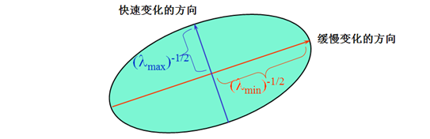

## 特征检测

**特征检测 (Feature detection)** 也称为**角点检测 (Corner detection)**，特征检测和匹配是许多计算机视觉应用中的一个重要组成部分，广泛应用于运动检测。图像匹配、视频跟踪、三维建模以及目标识别领域中。在 SLAM 前端，往往需要通过**特征跟踪 (Feature tracking)** 来先初步恢复相机的位姿。那么一张图向中的哪些特征是适合用来做匹配跟踪呢？通常拥有交大对比尺度（梯度）的图像块是比较容易定位的，又由于单一方向的直线段存在 “孔径问题 (aperture problem)” ，因而拥有至少两个（明显）不同方向梯度的图像块最容易定位。如下图所示：

从上图可以看出，不同图像块的孔径问题： (a) “角点” -- 稳定的，各方面都发生了重大变化； (b) “边 (edge)” -- 经典的孔径问题，沿边缘方向没有变化； (c) “平坦/无纹理的区域 (flat region)” -- 各方向都没有变化。从上面的描述我们认为通过移动一个小窗口会导致窗口中图像灰度变化剧烈，那么这个窗口中易于识别的特征是我们认为的角点。

## Harris 角点

### 基本原理

特征点在图像中一般有具体的坐标，并具有某些数学特征，如局部最大或最小灰度、以及某些梯度特征等。这些直觉可以这样来形式化：用最简单的图像块匹配策略来比较两个图像块，通过它们的（加权）差的平方和：

$$
E_{\mathrm{wssd}}(\mathbf{u}) = \sum_i \omega(\mathbf{x}_i)[I_1(\mathbf{x}_i+\mathbf{u}) - I_0(\mathbf{x}_i)]^2
$$

其中 $I_0$ 和 $I_1$ 是两幅需要比较的图像块，$\mathbf{u} = (u, v)$ 是平移向量， $\omega(\mathbf{x})$ 是在空间上变化的权重（或窗口）函数，求和变量 $i$ 作用于块中的全体图像像素。由于在进行特征检测时，并不知道该特征被匹配时会终止于哪些相对的其他图像位置的匹配。因此，只能在一个小的位置变化区域 $\Delta \mathbf{u}$ 内，通过于原图像块进行比较来计算这个匹配结果的稳定度，这就是通常所说的**自相关函数 (autocorrelation function)** 。

根据上述，对于给定图像 $I(x, y)$ 和固定尺寸的邻域窗口，计算窗口平移前后各个像素差值的平方和，即在点 $(x, y)$ 处平移 $(\Delta x, \Delta y)$ 后的自相关性：

$$
E_{AC}(x,y;\Delta x,\Delta y) = \sum_{(u,v)\in W(x,y)} \omega(u,v)[I(u+\Delta x, v+\Delta y) - I(u,v)]^2
$$

其中，$W(x,y)$ 是以点 $(x, y)$ 为中心的窗口，$\omega(x,y)$ 是窗口加权函数，它可取均值函数或者高斯函数，如下图所示：

根据泰勒展开，可得到窗口平移后图像的一阶近似：

$$
\begin{align*}
I(u+\Delta x, v+\Delta y) &= I(u,v) + I_x(u,v)\Delta x + I_y(u,v)\Delta y + O(\Delta x^2,\Delta y^2) \\
						& \approx I(u,v) + I_x(u,v)\Delta x + I_y(u,v)\Delta y
\end{align*}
$$

其中，$I_x , I_y$ 是图像 $I(x,y)$ 的偏导数，那么自相关函数可以简化为：

$$
\begin{align*}
E_{AC}(x,y;\Delta x,\Delta y) &\approx \sum_{(u,v)\in W(x,y)} \omega(u,v)[I_x(u,v)\Delta x + I_y(u,v)\Delta y]^2 \\
& = \begin{bmatrix} \Delta x & \Delta y \end{bmatrix} M(x,y) \begin{bmatrix} \Delta x \\ \Delta y \end{bmatrix}
\end{align*}
$$

其中，

$$
\begin{align*}
M(x,y) &= \sum_W \begin{bmatrix} I_x(x,y)^2 & I_x(x,y) I_y(x,y) \\ I_x(x,y)I_y(x,y) & I_y(x,y)^2 \end{bmatrix} \\
&= \begin{bmatrix} \sum_W I_x(x,y)^2 & \sum_W I_x(x,y) I_y(x,y) \\ \sum_W I_x(x,y)I_y(x,y) & \sum_W I_y(x,y)^2 \end{bmatrix} \\
&= \begin{bmatrix} A & C \\ C & B \end{bmatrix}
\end{align*}
$$

也就是说图像 $I(x,y)$ 在点 $(x, y)$ 处平移 $(\Delta x, \Delta y)$ 后的自相关函数可以近似为二项函数:

$$
E_{AC}(x,y;\Delta x,\Delta y) \approx A\Delta x^2 + 2C\Delta x \Delta y + B\Delta y^2
$$

其中有 $A = \sum_W I_x^2 \; , \; B=\sum_W I_y^2 \; , \; C=\sum_W I_x I_y$ 。

将梯度向量视为一组 $(dx，dy)$点，其质心定义为 $(0,0)$ 。通过散射矩阵 $M(x,y)$ 对该组点进行椭圆分析，根据不同情况分析椭圆参数。而 $x$ 和 $y$ 的导数分布可以用椭圆形状和大小的主成分来特征化，如下图所示：

二次项函数本质上是一个椭圆函数，椭圆的曲率和尺寸可由 $M(x,y)$ 的特征值 $λ1, λ2$ 决定，椭圆方向由 $M(x,y)$ 的特征向量决定，椭圆方程和其图形分别如下所示：

$$
\begin{bmatrix} \Delta x & \Delta y \end{bmatrix} M(x,y) \begin{bmatrix} \Delta x \\ \Delta y \end{bmatrix} = 1
$$

因此，对于矩阵 $M(x,y)$ ，可以将其和协方差矩阵类比，协方差表示多维随机变量之间的相关性，协方差矩阵对角线的元素表示的是各个维度的方差，而非对角线上的元素表示的是各个维度之间的相关性，在 [**PCA (主成分分析)**](https://en.wikipedia.org/w/index.php?title=Principal_component_analysis) 中，将协方差矩阵对角化，使不同维度的相关性尽可能的小，并取特征值较大的维度，来达到降维的目的。类似的，可以将矩阵 $M(x,y)$ 看成是一个二维随机分布的协方差矩阵，通过将其对角化，求取矩阵的两个特征值，并根据这两个特征值来判断角点。

椭圆函数特征值与图像中的角点、直线（边缘）和平面之间的关系共可分为三种情况（如下图所示）：

- 两个特征值都较大时为角点
- 一个特征值较大而另一个较小时则为图像边缘
- 两个特征值都较小时为均匀区域

根据二次项函数特征值的计算公式，我们可以求矩阵 $M(x,y)$ 的特征值。但是 Harris 给出的角点差别方法并不需要计算具体的特征值，而是计算一个角点的响应值 $R$ 来判断角点。$R$ 的计算公式：

$$
R = \det M - \alpha (trace M)^2
$$

上式中，$\det M$ 是矩阵 $M = \begin{bmatrix} A & C \\ C & B \end{bmatrix}$ 的行列式，$trace M$ 是矩阵 $M$ 的迹，$\alpha$ 为经验常数，通常取值为 $0.04 \sim 0.06$ 。事实上，特征值是隐含在 $\det M$ 和 $trace M$ 中的，因为：

$$
\det M = \lambda_1 \lambda_2 = AC-B^2 \\
traceM = \lambda_1 + \lambda_2 = A+C
$$

### 算法实现

根据上述，可以将 Harris 角点检测算法归纳如下：

- 计算图像 $I(x,y)$ 在 $X$ 和 $Y$ 两个方向上的梯度
  
    $$
  I_x = \frac{\partial I}{\partial x} = I \otimes \begin{bmatrix} -1 & 0 & 1 \end{bmatrix} ,
  I_y = \frac{\partial I}{\partial y} = I \otimes \begin{bmatrix} -1 & 0 & 1 \end{bmatrix}^\top
  $$

- 计算两个方向梯度的乘积
  
    $$
    I_x^2 = I_x \cdot I_x \;,\; I_y^2 = I_y \cdot I_y \;,\; I_{xy} = I_x \cdot I_y
    $$

- 使用高斯函数对 $I_x^2$ 、$I_y^2$ 和 $I_{xy}$ 进行高斯加权，生成矩阵 $M$ 的元素 $A$ 、 $B$ 和 $C$  
  
    $$
    A = g(I_x^2) = I_x^2 \otimes w \;,\; C = g(I_y^2) = I_y^2 \otimes w \;,\; B= g(I_{xy}) = I_{xy} \otimes w
    $$
    
- 计算每一个像素的 Harris 响应值 $R$ ，并对小于阈值 $t$ 的 $R$ 置零
  
    $$
    R = \left\{ R:\det M - \alpha (trace M)^2  > t \right\}
    $$
    
- 在 $3\times3$ 或者 $5\times5$ 大小的窗口邻域内进行非最大值抑制，局部最大值点即为图像中的角点。

### 性质

1. **参数α对角点检测的影响**：增大 $\alpha$ 的值，将减小角点响应值 $R$ ，减少被检测角点的数量；减小 $\alpha$ 的值，将增大角点响应值 $R$ ，增加被检测角点的数量。

2. **Harris 角点检测算子对亮度和对比度的变化不敏感** ：因为在进行 Harris 角点检测时，使用了微分算子对图像进行微分运算，而微分运算对图像密度的拉升或收缩和对亮度的抬高或下降不敏感。换言之，对亮度和对比度的仿射变换并不改变 Harris 响应的极值点出现的位置，但是，由于阈值的选择，可能会影响角点检测的数量。如下图所示：

   

3. **Harris 角点检测算子具有旋转不变性**：Harris 角点检测算子使用的是角点附近的区域灰度二阶矩矩阵。而二阶矩矩阵可以表示成一个椭圆，椭圆的长短轴正是二阶矩矩阵特征值平方根的倒数。当特征椭圆转动时，特征值并不发生变化，所以判断角点响应值 $R$ 也不发生变化，由此说明 Harris 角点检测算子具有旋转不变性。

4. **Harris 角点检测算子不具有尺度不变性**：如下图所示，当右图被缩小时，在检测窗口尺寸不变的前提下，在窗口内所包含图像的内容是完全不同的。左侧的图像可能被检测为边缘或曲线，而右侧的图像则可能被检测为一个角点。

   

### 多尺度 Harris 角点

Harris 角点具有灰度不变性和旋转不变性，但不具备尺度不变性，而尺度不变性对于图像的局部特征来说至关重要。将 Harris 角点检测算子和高斯尺度空间表示相结合，可有效解决这个问题。与 Harris 角点检测中的二阶矩表示类似，定义一个尺度自适应的二阶矩：

$$
M=\mu(x,y,\sigma_I,\sigma_D) = \sigma_D^2g(\sigma_I)\otimes
\begin{bmatrix}
	L_x^2(x,y,\sigma_D) & L_xL_y(x,y,\sigma_D) \\
	L_xL_y(x,y,\sigma_D) & L_y^2(x,y,\sigma_D)
\end{bmatrix}
$$

式中，$g(\sigma_I)$ 表示尺度为 $\sigma_I$ 的高斯卷积核，$L_x(x,y,\sigma_D)$ 和 $L_y(x,y,\sigma_D)$ 表示对图像使用高斯函数 $g(\sigma_D)$ 进行平滑后取微分的结构。$\sigma_I$ 通常称为积分尺度，是决定 Harris 角点当前尺度的变量，$\sigma_D$ 为微分尺度，是决定角点附近微分变化的变量，通常 $\sigma_I$ 应大于 $\sigma_D$ 。

具体的算法流程：

- 确定尺度空间的一组取值 $\sigma_I = (\sigma_0, \sigma_1 \dotsc, \sigma_n) = (\sigma, k\sigma, \dotsc, k^n \sigma) \;,\; \sigma_D = s\sigma_I$ ，一般情况下 $k=1.4 \;,\; s= 0.7$ 

- 对于给定的尺度空间值 $\sigma_D$ ，进行如下角点响应值的计算和判断，并做非极大值抑制处理
  
    $$
  cornerness = \det \left( \mu(x,y, \sigma_n) - \alpha \,trace^2 \left(\mu(x,y, \sigma_n)\right) \right) > threshold_H
  $$
  
- 在位置空间搜索候选角点后，还需在尺度空间上进行搜索，计算候选点的拉普拉斯响应值，并于与给定阈值作比较：
  
    $$
    F(x,\sigma_n) = \sigma_n^2 | L_{xx}(x,y,\sigma_n)+L_{yy}(x,y,\sigma_n) | > threshold_L
    $$

- 将响应值 $F$ 与邻近的两个尺度空间的拉普拉斯响应值进行比较，使其满足：
  
    $$
    F(x,y,\sigma_n) > F(x,y,\sigma_l) \;,\; l = n-1, n+1
    $$

这样既可确定在位置空间和尺度空间均满足条件的 Harris 角点。

## Shi-Tomasi算法

Shi-Tomasi 算法是 Harris 算法的改进。Harris 算法最原始的定义是将矩阵 $M$ 的行列式值与 $M$ 的迹相减，再将差值同预先给定的阈值进行比较。后来 Jianbo Shi 和 Carlo Tomasi 提出改进的方法，若两个特征值中较小的一个大于最小阈值，则会得到强角点。

Harris 角点的响应值 $R$ 为：

$$
R = \lambda_1\lambda_2-\alpha(\lambda_1+\lambda_2)^2
$$

而 Shi-Tomasi 角点的响应值 $R$ 则为：

$$
R = \min(\lambda_1,\lambda_2)
$$

## 参考

[^1]: Computer Vision: Algorithms and Applications, by Richard Szeliski.  Sections 4.1
[^2]: [CMU : Feature and corner detection & Feature descriptors and matching](http://www.cs.cmu.edu/~16385/)

[^3]: [Penn State University : Corner Detection](http://www.cse.psu.edu/~rtc12/CSE486/) 
[^4]: [A COMBINED CORNER AND EDGE DETECTOR](http://www.bmva.org/bmvc/1988/avc-88-023.pdf)
[^5]: [Scale & Affine Invariant Interest Point Detectors](https://www.robots.ox.ac.uk/~vgg/research/affine/det_eval_files/mikolajczyk_ijcv2004.pdf)
[^6]: [Code: Harris Detector](https://github.com/ronnyyoung/ImageFeatures)
[^7]: [思维之际博客](https://www.cnblogs.com/ronny/p/4009425.html)

--8<--
mathjax.txt
--8<--

