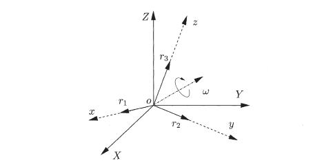
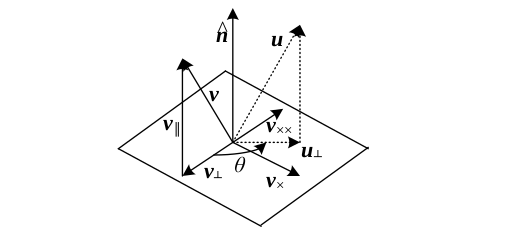
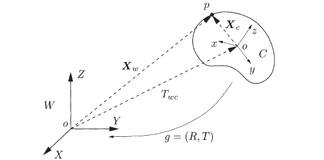

## 三维重建的起源

从一组二维视图重建世界的三维结构在计算机视觉领域有着悠久的历史。这是一个经典的*不适定问题 (ill-posed problem)*，因为重构一组一致的观察或图像相通常并不是唯一的。因此，我们需要附加一些假设。在数学上，研究三维场景与观测到的二维投影之间的几何关系是基于两种类型的变换，即，

- 用**欧几里得运动 (Euclidean motion)** 或**刚体运动 (rigid-body motion)** 来表示相机从当前帧到下一帧图像的运动
- 用**透视投影 (Perspective projection)** 来表示图像的形成过程 (如：**针孔相机 (pinhole camera)** 等)。

透视投影的概念起源于古希腊 (Euclid of Alexandria,  400 B.C.) 和文艺复兴时期 (Brunelleschi & Alberti, 1435)。透视投影的研究引出了**投影几何 (projective geometry)** 领域。

关于多视几何的第一个研究工作成果是来至于 Erwin Kruppa (1913) ，他指出五个点的两个视图足以确定两个视图之间的相对变换（运动） 和点的三维位置（结构）。Longuet-Higgins 在 1981 年提出了一种基于两视图**对极约束 (epipolar constraint)** 恢复运动结构重建的线性算法。在几本教科书中总结了一系列关于这方面的著作 (Faugeras 1993, Kanatani 1993, Maybank 1993, Weng et al. 1993) 。对三个视图的扩展由 Spetsakis 和 Aloimonos 87、90、Shashua 94 和 Hartley 95 研究发布的。多视图和正交投影的因子分解技术是由 Tomasi 和 Kanade 于 1992 年研究发布的。

相机运动与三维位置的联合估计称为**运动结构重建 (structure and motion)** 或**视觉 SLAM (visual SLAM)** 。

## 三维欧式空间

一般来说，欧几里得空间是一个集合，它的元素满足欧几里得的五个公理。三维的欧几里得空间 $\mathbb{E}^3$ 是由以下式为坐标的所有点 $P \in \mathbb{E}^3$ 组成的。

$$
\mathbf{X} \doteq [X_1, X_2, X_3]^\top = 
\begin{bmatrix} X_1 \\ X_2 \\ X_3 \end{bmatrix} \in \mathbb{R}^3
$$

通过这样一个**笛卡尔 (Cartesian) 坐标系**的赋值，可以在 $\mathbb{E}^3$ 和 $\mathbb{R}^3$ 之间建立一一对应关系。这里的 $\mathbb{E}^3$ 可以被视为等同于 $\mathbb{R}^3$ 。这意味着允许我们当讨论一个点 ( $\mathbb{E}^3$ ) 和坐标 ( $\mathbb{R}^3$ ) 犹如是一回事一样。笛卡尔坐标是使测量距离和角度成为可能的第一步。为此，必须为 $\mathbb{E}^3$ 赋予**度量标准 (metric)** 。 度量的精确定义依赖于向量的概念。

### 向量

在欧式空间中，一个向量 $\mathbf{v}$ 由一对点 $q, p \in \mathbb{E}^3$ 确定，被定义为链接 $p$ 到 $q$ 的有向箭头记号，表示称 $\mathbf{v} = \overrightarrow{pq}$ 。这里的点 $p$ 通常被称为是向量 $\mathbf{v}$ 的基点。假使点 $p$ 的坐标为 $\mathbf{X}$ ，点 $q$ 的坐标为 $\mathbf{Y}$ ，那么向量 $\mathbf{v}$ 的坐标为：

$$
\mathbf{v} = [v_1, v_2, v_3]^\top \doteq \mathbf{Y} - \mathbf{X} \in \mathbb{R}^3
$$

以上对向量的定位被称为**有界向量 (bound vector)** 。考虑这个向量独立于它的基点 $p$ 使得它是一个**自由向量 (free vector)** 。

!!! note ""  
    需要注意：点和向量是不同的几何对象。这一点很重要，我们很快就会看到，因为刚体运动对点和向量的作用是不同的。

所有自由向量 $\mathbf{v} \in \mathbb{R}^3$ 的集合构成一个线性向量空间。通过确定 $\mathbb{E}^3$ 和 $\mathbb{R}^3$ 之间的联系， $\mathbb{E}^3$ 的欧几里德度量标准仅由向量空间 $\mathbb{R}^3$ 上的一个**内积 (inner product，或称为点积，dot product)** 定义。有了这样一个度量标准 (metric) ，我们不仅可以测量点之间的距离（向量的模）或向量之间的角度，还可以计算曲线的长度或区域的体积。

运动粒子 $p$ 在 $\mathbb{E}^3$ 中的运动轨迹可用曲线 $\gamma(\cdot) : t \mapsto \mathbf{X} \in \mathbb{R}^3, t \in [0, 1]$ 来描述，则曲线的总长度为：

$$
l(\gamma(\cdot)) = \int_0^1 \| \dot{\mathbf{X}} (t) dt \|
$$

这里的 $\dot{\mathbf{X}} (t) = \frac{\mathrm d}{\mathrm d t} \big( \mathbf{X} (t) \big) \in \mathbb{R}^3$ 被称为曲线的切向量。 

### 叉积

在向量空间 $\mathbb{R}^3$ 上可以定义一个叉积运算，运算形式如下：

$$
\times : \mathbb{R}^3 \times \mathbb{R}^3 \to \mathbb{R}^3: \quad \mathbf{u} \times \mathbf{v} = \begin{bmatrix} u_2 v_3 - u_3 v_2  \\ u_3 v_1 - u_1 v_3 \\ u_1 v_2 - u_2 v_1 \end{bmatrix} \in \mathbb{R}^3
$$

其中，向量 $\mathbf{u, v}$ 的叉积结果是一个垂直于它们的向量。由于 $\mathbf{u} \times \mathbf{v} = - \mathbf{v} \times \mathbf{u}$ ，两个向量的外积正交于它的每个因子，因子的顺序决定了叉积结果的*方向 (orientation)*。这个方向满足**右手法则 (Right-hand rule)** 。

### 反对称矩阵

固定 $\mathbf{u}$ 可以因此一个通过反对称矩阵定义的线性映射： $\mathbf{v} \to \mathbf{u} \times \mathbf{v}$ ，该反对称矩阵表示成 $\hat{\mathbf{u}} \in \mathbb{R}^{3\times3}$ ，称为 “$\mathbf{u}$ **hat**” 。在一些文献中，反对称矩阵 $\hat{\mathbf{u}}$ 也可以表示成 $\mathbf{u}_\times \, \text{或} \, [\mathbf{u}]_\times$ ：

$$
\hat{\mathbf{u}} \doteq
\begin{bmatrix}
  0 & -u_3 & u_2 \\ u_3 & 0 & -u_1 \\ -u_2 & u_1 & 0
\end{bmatrix}
\in \mathbb{R}^{3\times3}
$$

因此，我们可将叉积写成 $\mathbf{u} \times \mathbf{v} = \hat{\mathbf{u}} \mathbf{v}$ 。反对称矩阵有 $\hat{\mathbf{u}}^\top = -\hat{\mathbf{u}}$ 。

反之，每一个反对称矩阵 $M = -M^\top \in \mathbb{R}^{3\times3}$ 可以通过向量 $\mathbf{u} \in \mathbb{R}^3$ 来关联识别。**帽 (hat)** , $\wedge : \mathbb{R}^3 \to so(3); \; \mathbf{u} \to \hat{\mathbf{u}}$ 运算符定义了一个*同构 (isomorphism)* 在空间 $\mathbb{R}^3$ 和所有由 $3\times3$ 反对称矩阵构成的 $so(3)$ 的子空间。它的逆操作称为 **vee** 操作 $\vee : so(3) \to \mathbb{R}^3; \; \hat{\mathbf{u}} \to \hat{\mathbf{u}}^\vee = \mathbf{u}$ 。

## 刚体运动

刚体的运动保持刚体上任意一对点 $(p,q)$ 之间的距离恒为 $d$ 。如下图所示：

因此，如果 $\mathbf{X}(t)$ 和 $\mathbf{Y}(t)$ 是物体上任意两点 $p,q$ 的坐标，那么它们的距离是恒定的：

$$
\| \mathbf{X}(t) - \mathbf{Y}(t) \| \equiv 常数, \quad \forall t \in \mathbb{R} \tag{1}
$$

**刚体运动 (rigid-body motion)** (或 **刚体变换 (rigid-body transformation)** ) 是一组映射，描述刚体上每个点的坐标如何在满足上式条件下随时间变化。将该映射表示成：

$$
g_t : \mathbb{R}^3 \to \mathbb{R}^3; \quad \mathbf{X} \to g_t({\mathbf{X}}) \quad t \in [0, T]
$$

且需要维持向量的**模 (norm)** 与**叉积 (cross product)** 满足以下两个式子：

- $\|g_t (\mathrm{v})\| = \|\mathrm{v}\|, \; \forall \mathrm{v} \in \mathbb{R}^3$ 
- $g_t(\mathrm{u}) \times g_t(\mathrm{v}) = g_t(\mathrm{u} \times \mathrm{v}), \forall \mathrm{u}, \mathrm{v} \in \mathbb{R}^3$ 

所有这些运动或变换的集合用 $SE(3)$ 表示。刚体运动引起的映射或变换称为**特殊欧几里德变换 (special Euclidean transformation)** 。“特殊” 一词表示转换是保持方向的。

根据上面刚体运动的定义，内积可以依赖范数通过*极化恒等式 (polarization identity)* 来定义：

$$
\langle u,v \rangle = \frac{1}{4} (\|u+v\|^2 - \|u-v\|^2)
$$

因此我们也可以说刚体运动是一个保持内积和外积的映射，而且根据定义可知道刚体运动也保留了**三重积 (triple product)** ：

$$
\langle g_t(u), g_t(v)\times g_t(w) \rangle = \langle u,v\times w \rangle, \forall u,v,w \in \mathbb{R}^3
$$

由于三重积对应于由这三个向量张成的平行六面体的体积，刚体运动也保留了**体积 (volume)** 。

### 刚体旋转的表达

如下图所示，刚体的旋转可以看作绕固定点 $o$ 沿着轴 $\omega$ 旋转。设参考系坐标 $W$ (实线) 是固定的，而旋转刚体的坐标系 $C$ (虚线) 与刚体绑定在一起。

坐标系 $C$ 相对于坐标系 $W$ 的构型 (或 “方位”) 由三个标准正交向量 $\mathbf{r}_1 = g_*(\mathbf{e}_1), \mathbf{r}_2 = g_*(\mathbf{e}_2), \mathbf{r}_3 = g_*(\mathbf{e}_3) \in \mathbb{R}^3$ 相对于世界坐标系 $W$ 的坐标变换决定。这三个向量 $\mathbf{r}_1, \mathbf{r}_2, \mathbf{r}_3$ 分别是沿着坐标系 $C$ 的三个主轴 $x, y, z$ 的单位向量。因此旋转矩阵的构型可以通过一个 $3 \times 3$ 的矩阵进行定义：

$$
R_{wc} \doteq [\mathbf{r}_1, \mathbf{r}_2, \mathbf{r}_3] \quad \in \mathbb{R}^{3 \times 3}
$$

其中三个向量 $\mathbf{r}_1, \mathbf{r}_2, \mathbf{r}_3$ 按照顺序堆叠成矩阵的三列。由于向量 $\mathbf{r}_1, \mathbf{r}_2, \mathbf{r}_3$ 来自正交坐标系，因此有

$$
\mathbf{r}_i^\top \mathbf{r}_j = \delta_{ij} \doteq \begin{cases} 1, & i = j \\ 0, & i \neq j \end{cases} \quad \forall i,j \in [1,2,3]
$$

将此用矩阵形式表示为

$$
R_{wc}^\top R_{wc} = R_{wc}R_{wc}^\top = I
$$

任何满足上述恒等式的矩阵称为**正交矩阵 (orthogonal matrix)** ，根据上面的定义，正交矩阵的逆就是它的转置： $R_{wc}^{-1} = R_{wc}^\top$ 。由于 $\mathbf{r}_1, \mathbf{r}_2, \mathbf{r}_3$ 构成了一个右手坐标系，因而进一步得到了 $R_{wc}$ 的行列式必须为 $+1$ 的条件。因此矩阵 $R_{wc}$ 是**特殊正交阵 (special orthogonal matrix)** ，这里的特殊指示了该矩阵是正定的。所有 $\mathbb{R}^{3 \times 3}$ 的特殊正交阵构成的空间定义如下：

$$
SO(3) \doteq \{ R \in \mathbb{R}^{3 \times 3} | R^\top R = I, \det(R) = +1 \}
$$

#### 旋转的指数表示

根据上述，我们可知在 $\mathbb{E}^3$ 空间中刚体运动的旋转可以通过一个 $3 \times 3$ 的旋转矩阵 $R \in SO(3)$ 表示。每一个旋转矩阵 $R$ 通过 $3 \times 3 = 9$ 元素定义。然而，这 $9$ 个元素并不是自由参数，因为它们必须满足 $R^\top R= I$ 的约束，这实际上对 $9$ 个元素施加了 $6$ 个独立的约束。因此，由旋转矩阵构成的空间 $SO(3)$ 的维度应该只有 $3$ 维，而 $9$ 参数中有 $6$ 实际上是多余的。

给定一个轨迹 $R(t) : \mathbb{R} \to SO(3)$ 描述一个连续的旋转运动，那么旋转必须满足下式：

$$
R(t) R^\top(t) = I
$$

计算上面方程对时间 $t$ 的导数，注意到右边是一个常数矩阵，可以得到

$$
\dot{R}(t) R^\top(t) + R(t) \dot{R}^\top(t) = 0 \quad \Rightarrow \quad \dot{R}(t) R^\top(t) = - (\dot{R}(t) R^\top(t))^\top
$$

根据性质，我们可知矩阵 $\dot{R}(t) R^\top(t) \in \mathbb{R}^{3 \times 3}$ 是一个反对称矩阵。 根据[反对称矩阵的性质](#反对称矩阵)，一定存在一个向量，设为 $\omega(t) \in \mathbb{R}^3$ ，使得

$$
\dot{R}(t) R^\top(t) = \hat{\omega}(t) \quad \Rightarrow \quad \dot{R}(t) = \hat{\omega}(t) R(t)
$$

根据上式，如果假设 $R(t_0) = I$ 且当 $t = t_0$ 时有 $\dot{R}(t_0) = \hat{\omega}(t_0)$ 。因此，围绕单位矩阵 $I$ ，偏对称矩阵给出了旋转矩阵的一阶近似

$$
R(t_0 + dt) \approx I + \hat{\omega}(t_0)dt
$$

综上可得，所有的斜对称矩阵张成的空间如下表示

$$
so(3) \doteq \{ \hat{\omega} \in \mathbb{R}^{3 \times 3} | \omega \in \mathbb{R}^3 \}
$$

它亦被称为旋转群 $SO(3)$ 在恒等点处的**切空间 (tangent space)** 。旋转群 $SO(3)$ 被称为**李群 (Lie group)** ，而它的切空间 $so(3)$ 被称为**李代数 (Lie algebra)** 。

##### 李群和李代数

李群 (或无穷小群) 是一个光滑的流形，也是一个群，因此群运算乘法和逆运算是光滑的映射。在单位元处与李群相切的空间称为相关的李代数。从李代数到李群的映射称为指数映射，它的逆过程叫做对数映射。

李群与李代数涉及到庞大的知识量，这里对这部分就不进行拓展描述。后续或许会有专门的篇幅来记录这些知识点，再进行添加链接跳转（#TODO）。这部分知识我当时是阅读了[《机器人学中的状态估计》](http://asrl.utias.utoronto.ca/~tdb/) 中相关的篇幅来学习的。当然读者也可以阅读更加数学性的书籍来学习，这里就不在引申。

!!! tip "Sophus Lie (1841 - 1899)"
    马里乌斯·索菲斯·李 (Marius Sophus Lie) 是一位出生于挪威的数学家。他创立了连续对称理论，并将其应用于几何和微分方程的研究。他最大的成就之一是发现连续变换群在线性化的版本中更容易理解 (Theorie der transformation sgruppen 1893)。这些无限小的生成器构成了一个今天被称为李代数的结构。群律的线性化版本对应于李代数上的一个操作，称为换向器托架或李托架。

##### 指数映射

我们先假设矩阵 $\hat \omega$ 是一个常量，那么

$$
\dot R(t) = \hat \omega R(t)
$$

上式中矩阵 $R(t)$ 可以解释为以下**线性常微分方程 (linear ordinary differential equation (ODE))**的**状态转移矩阵 (state transition matrix)** 

$$
\dot x(t) = \hat \omega x(t) , \quad x(t) \in \mathbb{R}^3
$$

上式线性常微分方程的解为

$$
x(t) = e^{\hat \omega t} x(0)
$$

其中 $e^{\hat \omega t}$ 是矩阵指数

$$
e^{\hat \omega t} = I + \hat\omega t + \frac{(\hat\omega t)^2}{2!} + \dotsb + \frac{(\hat\omega t)^n}{n!} + \dotsb
$$

其中，指数 $e^{\hat \omega t}$ 通常记为 $\exp ( \hat \omega t)$ 。由于上式线性常微分方程具有唯一解，那么假设 $R(0) = I$ 为初始条件，那么有：

$$
R(t) = e^{\hat \omega t}
$$

为了验证矩阵 $e^{\hat \omega t}$ 确实是一个旋转矩阵，可以直接从矩阵指数的定义中看出

$$
(e^{\hat \omega t})^{-1} = e^{- \hat \omega t} = e^{\hat \omega^\top t} = (e^{\hat \omega t})^\top
$$

因此 $(e^{\hat \omega t})^\top e^{\hat \omega t} = I$ 。 $R(t) = e^{\hat \omega t}$ 的物理解释是如果 $\| \omega \| = 1$，那么 $R(t)$ 是一个沿 $\omega$ 为轴，弧度大小为 $t$ 的旋转。通常， $t$ 可以乘到 $\omega$ 中去，因此有 $R = e^{\hat\omega}$ ，其中 $\omega$ 的模为任意有理数。所以，根据上文所述，矩阵指数确实定义了空间 $so(3)$ 到 $SO(3)$ 之间的空间映射，即所谓的**指数映射 (exponential map)** :

$$
\exp : so(3) \to SO(3); \quad \hat \omega \mapsto e^{\hat \omega}
$$

以上的所有推导到是在假设矩阵 $\hat \omega$ 是一个常量的前提下，那么对于任意的 $R \in SO(3)$ 是否都可以通过 $R(t) = e^{\hat \omega t}$ 来表示呢。答案是肯定的，接下来会对这个疑问进行阐述。

##### 对数映射

对于任意的 $R \in SO(3)$ 存在任意的 $\omega \in \mathbb{R}^3$ 使得 $R = \exp( \hat \omega)$ 。我们定义它的逆过程为**对数映射 (exponential map)** ：$\hat \omega = \log (R)$ 。

如果旋转矩阵 $R \neq I$ 且定义为：

$$
R = \begin{bmatrix} r_{11} & r_{12} & r_{13} \\ r_{21} & r_{22} & r_{23} \\ r_{31} & r_{32} & r_{33} \end{bmatrix}
$$

那么对应的 $\omega$ 通过下式计算：

$$
\| \omega \| = \cos^{-1} \left( \frac{trace(R)-1}{2} \right) , \quad \frac{\omega}{\| \omega \|} = \frac{1}{2\sin(\| \omega \|)} \begin{bmatrix} r_{32} - r_{23} \\ r_{13} - r_{31} \\ r_{21} - r_{12} \end{bmatrix}
$$

如果 $R = I$ ，那么 $\| \omega \| = 0$ ，而 $\frac{\omega}{\| \omega \|}$ 没有定义 (因此可以任意选择) 。

从上面的描述可以得知：任意旋转矩阵可以通过绕以固定旋转轴 $\omega$ 旋转一个特定的角度 $\| \omega \|$ 得到。然而从 $so(3)$ 到 $SO(3)$ 对数映射并不是一一对应的，这是因为任何一个 $2k\pi\omega, k\in Z$ 都可以得到相同的旋转矩阵 $R$ 。

##### 罗德里格斯旋转

通过对数映射，我们知道了如何通过一个旋转矩阵求解它的指数坐标 $\omega$ 。那么如何通过一个指数坐标 $\omega$ 求解一个旋转矩阵 $R = e^{\hat\omega}$ 呢？当然可以通过它本身的定义：

$$
e^{\hat \omega} = I + \hat\omega + \frac{(\hat\omega)^2}{2!} + \dotsb + \frac{(\hat\omega)^n}{n!} + \dotsb
$$

然后一种更加有效的求解方式是通过**罗德里格斯 (Rodrigues)**公式进行求解。令 $\omega = \phi \mathbf{x}$ 其中 $\phi = \| \omega \|$ 为旋转角度，$\mathbf{x} = \omega / \| \omega \|$ 是单位长度旋转轴。根据反对称矩阵的性质有：

$$
\hat{\mathbf{x}}^2 = \mathbf{x}\mathbf{x}^\top - I, \quad \hat{\mathbf{x}}^3 = -\hat{\mathbf{x}}
$$

那么

$$
\begin{align*}
e^{\hat \omega} &= e^{\phi \hat{\mathbf{x}}} \\
&= I + \phi \hat{\mathbf{x}} + \frac{(\phi \hat{\mathbf{x}})^2}{2!} + \dotsb + \frac{(\phi \hat{\mathbf{x}})^n}{n!} + \dotsb \\
&= I + \phi \hat{\mathbf{x}} + \frac{1}{2!}\phi^2 \hat{\mathbf{x}}\hat{\mathbf{x}} + \frac{1}{3!}\phi^3 \underbrace{\hat{\mathbf{x}}\hat{\mathbf{x}}\hat{\mathbf{x}}}_{-\hat{\mathbf{x}}} + \frac{1}{4!}\phi^4 \underbrace{\hat{\mathbf{x}}\hat{\mathbf{x}}\hat{\mathbf{x}}\hat{\mathbf{x}}}_{-\hat{\mathbf{x}}\hat{\mathbf{x}}} - \dotsb \\
&= I + \underbrace{\left(\phi - \frac{1}{3!}\phi^3 + \frac{1}{5!}\phi^5 - \dotsb \right)}_{\sin \phi} \hat{\mathbf{x}} + \left[1- \underbrace{\left(1 - \frac{1}{2!}\phi^2 + \frac{1}{4!}\phi^4 - \dotsb \right)}_{\cos \phi} \right]\hat{\mathbf{x}}\hat{\mathbf{x}} \\
&= I + \sin(\|\omega\|)\frac{\hat\omega}{\|\omega\|} + (1-\cos(\|\omega\|))\frac{\hat\omega^2}{\|\omega\|^2} \\
&= \cos(\|\omega\|)I + (1-\cos(\|\omega\|))\frac{\hat\omega\hat\omega^\top}{\|\omega\|^2} + \sin(\|\omega\|)\frac{\hat\omega}{\|\omega\|}
\end{align*}
$$

根据上面的推导，我们可以得到已知一个旋转向量 $\omega$ 求解出旋转矩阵的方式。下面给出一个更加直观的物理表现。如下图所示，我们知道任意旋转都可以表示成绕一单位旋转轴 $\mathbf{n}$ 旋转 $\theta$ 角，等价与通过一个旋转向量 $\omega = \theta\mathbf{n}$ 。

根据上图有 $\mathbf{v}$ 绕单位旋转轴 $\mathbf{n}$ 旋转 $\theta$ 角后得到 $\mathbf{u}$ ，那么这一旋转过程的表示可以通过以下推导所得。

首先，目标向量 $\mathbf{v}$ 平行于 $\mathbf{n}$ 的分量表示为

$$
\mathbf{v}_{\|} = \mathbf{n}(\mathbf{n} \cdot \mathbf{v}) = (\mathbf{n}\mathbf{n}^\top)\mathbf{v}
$$

$\mathbf{v}$ 平行于 $\mathbf{n}$ 的分量分量不受旋转影响。接着，计算目标向量 $\mathbf{v}$ 垂直于 $\mathbf{n}$ 的分量

$$
\mathbf{v}_\bot = \mathbf{v} - \mathbf{v}_{\|} = (I - \mathbf{nn^\top})\mathbf{v}
$$

可以通过叉乘将这部分垂直分量旋转 $90^\circ$ 

$$
\mathbf{v}_{\times} = \mathbf{n}\times\mathbf{v} = \hat{\mathbf{n}}\mathbf{v}
$$

再一次旋转 $90^\circ$ 得

$$
\mathbf{v}_{\times\times} = \mathbf{n}\times\mathbf{v}_{\times} = \hat{\mathbf{n}}^2 \mathbf{v} = -\mathbf{v}_{\bot}
$$

因此

$$
\mathbf{v}_{\|} = \mathbf{v} - \mathbf{v}_{\bot} = \mathbf{v} + \mathbf{v}_{\times\times} = (I + \hat{\mathbf{n}}^2)\mathbf{v}
$$

进而，我们可以得到旋转后向量 $\mathbf{u}$ 位于以 $\mathbf{n}$ 为法向量的平面分量

$$
\mathbf{u}_{\bot} = \cos\theta\mathbf{v}_{\bot} + \sin\theta\mathbf{v}_{\times} = (\sin\theta\hat{\mathbf{n}} - \cos\theta\hat{\mathbf{n}}^2)\mathbf{v}
$$

最后我们得到旋转之后的向量 $\mathbf{u}$ 

$$
\mathbf{u} = \mathbf{u}_{\bot} + \mathbf{v}_{\|} = (I + \sin\theta\hat{\mathbf{n}} + (1-\cos\theta)\hat{\mathbf{n}}^2) \mathbf{v}
$$

由此，我们可以将旋转矩阵表示为

$$
R(\mathbf{n}, \theta) = I + \sin\theta\hat{\mathbf{n}} + (1-\cos\theta)\hat{\mathbf{n}}^2
$$

### 刚体运动变换的表达

在上文的描述中，我们已经知道了刚体纯旋转运动的表示与对应的旋转矩阵的计算。在接下来的篇幅中，我们将介绍刚体更加一般性的运动变换，包含了旋转与平移。

如上图所示，一个坐标系为 $C$ 的移动刚体上存在一点 $p$ ，点 $p$ 关于参考世界坐标系 $W$ 的表示可以简单的关联称计算向量 $X_w$ 来得到。而 $X_w$ 的计算可以归简为一个世界坐标系 $W$ 下由原点指向刚体坐标系 $C$ 原点的平移向量 $T_{wc} \in \mathbb{R}^3$ 和转换到世界坐标系 $W$ 下的向量 $X_c$ 的向量和

$$
X_w = R_{wc}X_c + T_{wc}
$$

因此，刚体运动的空间由一组**特殊的欧几里德变换 (special Euclidean transformations)** 给出

$$
SE(3) \doteq \{ g=(R,T) | R \in SO(3), T \in \mathbb{R}^3 \}
$$

上述的刚体运动变换是仿射变换而非线性变换。我们利用**齐次坐标系 (homogeneous coordinates)** ，将它转换称线性变换

$$
SE(3) \doteq \left\{ g=\begin{bmatrix}R & T \\ 0 & 1 \end{bmatrix} \: \Bigg| \: R \in SO(3), T \in \mathbb{R}^3 \right\} \subset \mathbb{R}^{4\times4}
$$

#### 刚体运动的正则指数坐标

我们已经了解了旋转矩阵 $R \in SO(3)$ 的指数坐标形式，推广相似的坐标化到应用齐次性表示的刚体运动 $g \in SE(3)$ 。考虑一个连续运动的刚体轨迹为 $SE(3) : g(t) = (R(t), T(t))$ ，用齐次坐标表示为：

$$
g(t) = \begin{bmatrix} R(t) & T(t) \\ 0 & 1 \end{bmatrix} \in \mathbb{R}^{4\times4}
$$

按照刚体纯旋转形式类推，首先考虑以下形式矩阵

$$
\dot g(t) g^{-1}(t) = \begin{bmatrix} \dot R(t)R^\top(t) & \dot T(t) - \dot R(t) R^\top(t)T(t) \\ 0 & 0 \end{bmatrix} \in \mathbb{R}^{4\times4}
$$

已知 $\dot R(t)R^\top(t)$ 是一个反对称矩阵，存在 $\hat\omega(t) \in so(3)$ 使得 $\hat\omega(t) = \dot R(t)R^\top(t)$ ，定义一个向量 $v(t) = \dot T(t) - \dot R(t) R^\top(t)T(t)  \in \mathbb{R}^3$ 。那么上式可以转变成

$$
\dot g(t) g^{-1}(t) = \begin{bmatrix} \hat\omega(t)  & v(t) \\ 0 & 0 \end{bmatrix} \in \mathbb{R}^{4\times4}
$$

进一步定义矩阵 $\hat \xi \in \mathbb{R}^{4\times4}$ 为

$$
\hat \xi(t) = \begin{bmatrix} \hat\omega(t)  & v(t) \\ 0 & 0 \end{bmatrix}
$$

那么有

$$
\dot g(t) = (\dot g(t) g^{-1}(t)) g(t) = \hat \xi(t)g(t)
$$

这里的 $\hat \xi$ 可以被认为沿这虚线 $g(t)$ 的 “切向量” ，且可以用于 $g(t)$ 的局部近似：

$$
g(t+dt) \approx g(t) + \hat\xi(t) g(t)dt = (I + \hat\xi(t)dt)g(t)
$$

形如 $\hat \xi$ 的 $4\times4$ 的矩阵被称为**扭曲 (twist)** 。所有的扭曲构成一个空间，被定义成

$$
se(3) \doteq \left\{ \hat\xi = \begin{bmatrix} \hat\omega & v \\ 0 & 0 \end{bmatrix} \; \bigg | \; \hat\omega \in so(3), v \in \mathbb{R}^3 \right\} \subset \mathbb{R}^{4\times4}
$$

这里的集合 $se(3)$ 被称为矩阵群 $SE(3)$ 的切空间或者李代数。定义两个操作 “$\vee$” 和 “$\wedge$” 关联扭曲 $\hat \xi \in se(3)$ 和它的扭曲坐标 $\xi \in \mathbb{R}^6$ 如下所示：

$$
\begin{bmatrix} \hat\omega & v \\ 0 & 0 \end{bmatrix}^\vee \doteq \begin{bmatrix} v \\ \omega \end{bmatrix} \in \mathbb{R}^6 , \quad \begin{bmatrix} v \\ \omega \end{bmatrix}^\wedge \doteq \begin{bmatrix} \hat\omega & v \\ 0 & 0 \end{bmatrix} \in \mathbb{R}^{4\times4}
$$

在扭曲坐标 $\xi$ 下，将 $v$ 表示为线速度，$\omega$ 表示为角速度，这表明它们分别与刚体运动的位移和旋转相关。考虑特殊情况下（匀速变换运动）时， $\hat\xi$ 为常数矩阵

$$
\dot g(t) = \hat \xi g(t)
$$

我们又得到了一个时不变线性常微分方程，它的解可以通过下式计算给出

$$
g(t) = e^{\hat\xi t} g(0)
$$

假设初始条件 $g(0) = I$ ，这上式结果为

$$
g(t) = e^{\hat\xi t}
$$

其中扭曲的指数为

$$
e^{\hat\xi t} = I + \hat\xi t + \frac{(\hat\xi t)^2}{2!} + \cdots + \frac{(\hat\xi t)^n}{n!} + \cdots
$$

通过前面小节介绍的 Rodrigues 法则和矩阵指数的附加性质，可以建立如下关系

$$
e^{\hat\xi} = \begin{bmatrix} e^{\hat\omega} & \frac{(I-e^{\hat\omega})\hat\omega v + \omega \hat\omega v}{\|\omega\|} \\ 0 & 1 \end{bmatrix}, \text{if} \quad \omega \neq 0
$$

如果 $\omega = 0$ ，那么指数化为简单的 $e^{\hat\xi} = \begin{bmatrix} I & v  \\ 0 & 1 \end{bmatrix}$ ，由上式可知， $\xi$ 的指数确实是 $SE(3)$ 中的刚体变换矩阵。因此，指数映射定义了从 $se(3)$ 空间到 $SE(3)$ 空间的变换形式

$$
\exp: se(3) \to SE(3); \; \hat\xi \mapsto e^{\hat\xi}
$$

类似于 $\hat\omega \in so(3)$ 与 $SO(3)$ 的关系，我们称 ${\hat\xi} \in se(3)$ 是 $SE(3)$ 的指数坐标。对于任意的 $g \in SE(3)$ 必定存在一个扭曲坐标 $\xi = (v, \omega)$ 使得 $g = \exp(\hat\xi)$ 。我们称这个指数映射的逆过程为对数映射 ${\hat\xi} = \log(g)$ 。

### 坐标和速度变换

在 SLAM 的研究过程中，经常需要知道一个点的坐标和它的速度如何随着摄像机的移动而变化。这是因为通常选择相机帧作为参考帧，并描述相机运动和与之相关的三维点更为方便。由于相机可能在移动，我们需要知道如何将坐标和速度等量从一个相机帧转换到另一个相机帧。特别是，我们想知道如何正确地表达一个点相对于一个运动的相机的位置和速度。

#### 坐标变换规则

我们将应用一个刚体变换

$$
g(t) = \begin{bmatrix} R(t) & T(t) \\ 0 & 1 \end{bmatrix} \in SE(3)
$$

去表示在 $t$ 时刻刚体相对于一个固定参考系下的运动变换。我们假设一个特殊情况，在 $t = 0$ 的时候，刚体坐标系与固定参考坐标系重合，即 $g(0) = I$ 。固定参考系下的任意点 $\mathbf{X}_0$ ，在 $t$ 时刻它对应到刚体坐标系下的坐标为

$$
\mathbf{X}(t) = R(t)\mathbf{X}_0 + T(t)
$$

或者应用齐次坐标表示为

$$
\mathbf{X}(t) = g(t)\mathbf{X}_0
$$

如上图所示，给出两个不同的时刻 $t_1$ 和 $t_2$ ，那么 $t_1$ 时刻刚体参考系下的点到 $t_2$ 时刻刚体参考系下的点变换式为

$$
\mathbf{X}(t_2) = g(t_2, t_1)\mathbf{X}(t_1)
$$

易得

$$
\mathbf{X}(t_3) = g(t_3, t_2)\mathbf{X}(t_2) = g(t_3, t_2)g(t_2, t_1)\mathbf{X}(t_1) = g(t_3, t_1)\mathbf{X}(t_1)
$$

因此有

$$
g(t_3, t_2)g(t_2, t_1) = g(t_3, t_1)
$$

通过把 $t_1$ 时刻坐标系的坐标转换到 $t_2$ 时刻坐标系的坐标，然后再转换回来，我们可以看到

$$
\mathbf{X}(t_1) = g(t_1, t_2)\mathbf{X}(t_2) = g(t_1, t_2)g(t_2, t_1)\mathbf{X}(t_1)
$$

因此可得

$$
g(t_1, t_2)g(t_2, t_1) = I \iff g^{-1}(t_1, t_2) = g(t_2, t_1)
$$

综上所述，我们可以得到刚体运动的坐标变换规则概括为

$$
\mathbf{X}_i = g_{ij}\mathbf{X}_j \;,\; g_{ik} = g_{ij}g_{jk} \;,\; g^{-1}_{ij} = g_{ji}
$$

#### 速度变换规则

根据坐标变换规则，我们知道固定参考系下一点 $p$ 的坐标 $\mathbf{X}_0$ 转换到在 $t$ 时刻刚体坐标系下为 $\mathbf{X}(t) = g_{cw}(t) \mathbf{X}_0$ ，那么在 $t$ 时刻点 $p$ 相对于刚体的瞬时速度为

$$
\dot{\mathbf{X}}(t) = \dot g_{cw}(t) \mathbf{X}_0 = \dot g_{cw}(t) g^{-1}_{cw}(t)\mathbf{X}(t)
$$

通过引入扭曲坐标

$$
\hat V^c_{cw}(t) \doteq g_{cw}(t) g^{-1}_{cw}(t) = \begin{bmatrix} \hat\omega(t) & v(t) \\ 0 & 0 \end{bmatrix} \in se(3)
$$

由此，可以获得

$$
\dot{\mathbf{X}}(t) = \hat V^c_{cw}(t)\mathbf{X}(t)
$$

在 3D 非齐次坐标系下表示为

$$
\dot{\mathbf{X}}(t) = \hat\omega(t)\mathbf{X}(t) + v(t)
$$

因此，符号 $\hat V^c_{cw}(t)$ 表示从摄像机帧中看到的世界帧的相对速度。假设一个观测者 $A$ 从不同帧的坐标系观察当前帧，则该变换为：$g_{yx} : \mathbf{Y}(t) = g_{yx} \mathbf{X}(t)$ ，此时，观察者帧坐标系下的速度为

$$
\dot{\mathbf{Y}}(t) = g_{yx} \dot{\mathbf{X}}(t) = g_{yx} \hat{V}(t) \mathbf{X}(t) = g_{yx} \hat{V}(t) g_{yx}^{-1} \mathbf{Y}(t)
$$

这表明，从观测者 $A$ 帧中观测到的点的相对速度用扭曲表示

$$
\hat V_y = g_{yx} \hat{V} g_{yx}^{-1} \doteq \text{ad}_{g_{xy}}(\hat V)
$$

由此，引出了在 $se(3)$ 域上的**伴随映射 (adjoint map)**：

$$
\text{ad}_g : se(3) \to se(3); \quad \hat\xi \mapsto g \hat\xi g^{-1}
$$

### 总结

|              |                         旋转 SO(3)                         |                        刚体运动 SE(3)                        |
| :----------: | :--------------------------------------------------------: | :----------------------------------------------------------: |
| **矩阵表示** | $R: \begin{cases} R^\top R = I \\ \det(R) = 1 \end{cases}$ |      $g = \begin{bmatrix} R & T \\ 0 & 1 \end{bmatrix}$      |
| **坐标变换** |               $\mathbf{X} = R \mathbf{X}_0$                |              $\mathbf{X} = R \mathbf{X}_0 + T$               |
|    **逆**    |                     $R^{-1} = R^\top$                      | $g^{-1} = \begin{bmatrix} R^\top & -R^\top T \\ 0 & 1 \end{bmatrix}$ |
| **运算规则** |                  $R_{ik} = R_{ij}R_{jk}$                   |                   $g_{ik} = g_{ij}g_{jk}$                    |
| **指数映射** |                   $R = \exp(\hat\omega)$                   |                     $g = \exp(\hat\xi)$                      |
|   **速度**   |         $\dot{\mathbf{X}} = \hat\omega \mathbf{X}$         |        $\dot{\mathbf{X}} = \hat\omega \mathbf{X} + v$        |
| **伴随映射** |          $\hat\omega \mapsto R \hat\omega R^\top$          |              $\hat\xi \mapsto g \hat\xi g^{-1}$              |

另，刚体的旋转还可以用四元数或者欧拉角来表示，这部分这里不在引申，读者可以阅读相关的文档，如果后续有对这部分内容进行书写，再在这里链接补充（#TODO）

--8<--
mathjax.txt
--8<--