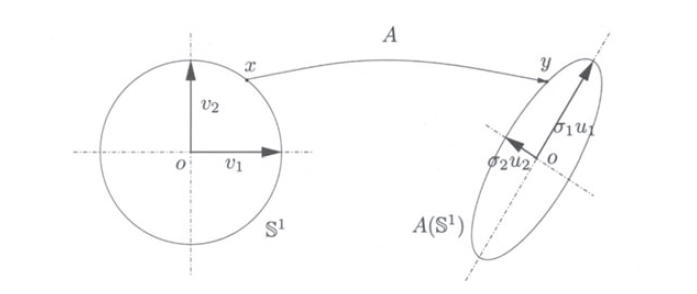

## 线性空间的基本概念

### 向量空间

如果集合 $V$ 在*矢量求和 (vector summation)*  

$$
+ : V \times V \to V
$$

以及*标量乘法 (scalar multiplication)*

$$
\cdot : \mathbb{R} \times V \to V
$$

运算下是闭合的，那么集合 $V$ 就称为在 $\mathbb{R}$ 域上的*线性空间 (linear space)* 或 *向量空间 (vector space)* 。

换言之，如果 $V​$ 是一个向量空间，那么对于任意的两个向量 $\mathbf{v_1}, \mathbf{v_2} \in V​$ 和两个标量 $\alpha, \beta \in \mathbb{R}​$ ，他们的线性组合 $\alpha \mathbf{v_1} + \beta \mathbf{v_2} \in V​$ 。此外，加法运算($+​$) 满足**交换律**和**结合律**，且存在**幺元 ($0​$)** 以及每个元素存在**逆 ($- \mathbf{v}​$)** 。标量乘法 ($\cdot​$) 在 $\mathbb{R}​$ 域上有：$\alpha (\beta \mathbf{v}) = (\alpha \beta)\mathbf{v}​$，　$1\mathbf{v} = \mathbf{v}​$ 和 $0\mathbf{v} = \mathbf{0}​$ 。加法和标量乘法满足**分配率**：$(\alpha + \beta) \mathbf{v} = \alpha \mathbf{v} + \beta \mathbf{v}​$，　$\alpha(\mathbf{v} + \mathbf{u}) = \alpha \mathbf{v} + \alpha \mathbf{u}​$ 。  
例如： $\mathbb{R}^n​$ 就是实数域 $\mathbb{R}​$ 上的线性空间。根据上述此时  $V = \mathbb{R}^n​$ ， $\mathbf{v} = [x_1, \dotsc , x_n]^\top​$ 。

一个集合 $W \subset V​$ ，$V​$ 是一个向量空间的话，如果 $0 \in W​$ 且集合 $W​$ 对于任意的 $\alpha \in \mathbb{R}​$ 在 $+​$ 和 $\cdot​$ 上是闭合的，那么 $W​$ 称为 $V​$ 的**子空间 (subspace)**。

### 线性独立与基

一组向量 $S = \{\mathbf{v_1}, \dotsc , \mathbf{v_k}\} \subset V$ 张成的子空间，是由这些向量的所有线性组合构成的子空间：

$$
span(S) = \{ \mathbf{v} \in V | \mathbf{v} = \sum_{i=1}^k \alpha_i \mathbf{v_i}\}
$$

如果，

$$
\sum_{i=1}^k \alpha_i \mathbf{v}_i = \mathbf{0} \Rightarrow \alpha_i =  0   \forall i
$$

那么集合 $S​$ 就被称为**线性独立 (linearly independent)** 。

换句话说，如果集合 $S$ 中的任意一个向量无法用其余向量的线性组合表示的话，那么称为线性独立，反之称为**线性相关 (linearly dependent)** 。

一个向量集合 $B = \{\mathbf{v_1}, \dotsc, \mathbf{v}_n\}$ 如果他是线性独立且它可以张成向量空间 $V$ ，那么称 $B$ 是 $V$ 的**基 (basis)**。基是线性无关向量的最大集合。

#### 基的性质

如果 $B​$ 与 $B^{\prime}​$ 是线性空间 $V​$ 的两个基，那么：  

- $B​$ 与 $B^{\prime}​$ 将包含相同数量的线性独立向量，这个数量 $n​$ 被称为向量空间 $V​$ 的**维度  (dimension)** 。

- 让 $B = \{ b_i \}_{i = i}^n$ 和 $B' = \{ b'_i \}_{i = i}^n$ ，那么 $B$ 中的任意一个基向量都能够利用 $B^{\prime}$ 的线性组合形式表示： 

    $$
    b_j = a_{1j} b'_1 + a_{2j} b'_2 + \dotsb + a_{nj} b'_n　　a_{ij} \in \mathbb{R}, i, j = 1, 2, \dotsc, n
    $$

    这里用于**基底变换 (basis transform)** 的系数 $a_{ij}$ 能够被组合成矩阵 $\mathbf{A}$ ，那么我们可以用矩阵的形式来表示 $B \doteq [ b_1, b_2, \dotsc, b_n ]$ 和 $B' \doteq [ b'_1, b'_2, \dotsc, b'_n ]$ 之间的变换关系了：

    $$
    [ b_1, b_2, \dotsc, b_n ] = [ b'_1, b'_2, \dotsc, b'_n ] 
    	\begin{bmatrix}
        a_{11} & a_{12} & \cdots & a_{1n} \\
        a_{21} & a_{22} & \cdots & a_{2n} \\
        \vdots  & \vdots  & \ddots & \vdots  \\
        a_{n1} & a_{n2} & \cdots & a_{nn} 
      \end{bmatrix}
    $$

    即 $B = B' A$ ，当矩阵 $\mathbf{A}$ 可逆时，有 $B’ = B A^{-1}$ 。

- 任意一个向量 $\mathbf{v} \in V​$ 都能够写成基向量的线性组合：

    $$
    \mathbf{v} = x_1 b_1 + x_2 b_2 + \dotsb + x_n b_n = x'_1 b'_1 + x'_2 b'_2 + \dotsb + x'_n b'_n
    $$

    其中系数 $\{ x_i \in \mathbb{R} \}_{i=1}^n$ 和 $\{ x'_i \in \mathbb{R} \}_{i=1}^n$ 是唯一且确定的，称为 $\mathbf{v}$ 在每一基底下的坐标。结合上一条性质，有：

    $$
    \mathbf{v} 
    = 
    [ b_1, b_2, \dotsc, b_n ]
    \begin{bmatrix}
    x_1 \\ x_2 \\ \vdots \\ x_n
    \end{bmatrix}
    = 
    [ b'_1, b'_2, \dotsc, b'_n ] 
    \begin{bmatrix}
      a_{11} & a_{12} & \cdots & a_{1n} \\
      a_{21} & a_{22} & \cdots & a_{2n} \\
      \vdots & \vdots & \ddots & \vdots \\
      a_{n1} & a_{n2} & \cdots & a_{nn} 
    \end{bmatrix}
    \begin{bmatrix}
    x_1 \\ x_2 \\ \vdots \\ x_n
    \end{bmatrix}
    $$

    由于 $\mathbf{v}$ 关于 $B^{\prime}$ 的坐标是唯一的，因此可以得到一个向量从一个基底到另一个基底的坐标变换为：

    $$
    \begin{bmatrix}
    x'_1 \\ x'_2 \\ \vdots \\ x'_n
    \end{bmatrix}
    = 
    \begin{bmatrix}
      a_{11} & a_{12} & \cdots & a_{1n} \\
      a_{21} & a_{22} & \cdots & a_{2n} \\
      \vdots & \vdots & \ddots & \vdots \\
      a_{n1} & a_{n2} & \cdots & a_{nn} 
    \end{bmatrix}
    \begin{bmatrix}
    x_1 \\ x_2 \\ \vdots \\ x_n
    \end{bmatrix}
    $$

!!! note ""
    **注意变换基底和变换坐标的区别：**  
    
    $$
    B' = B A^{-1},　　\mathbf{x}' = A \mathbf{x}
    $$

### 内积与正交性

#### 内积

当满足：  

1. $\langle u, \alpha v + \beta w \rangle =  \alpha \langle u, v \rangle + \beta \langle u, w \rangle，　\forall \alpha, \beta \in \mathbb{R}​$ （线性的）
2. $\langle u, v \rangle ＝ \langle v, u \rangle​$  （对称的/均匀的）
3. $\langle v, v \rangle \geq 0​$ 且 $\langle v, v \rangle = 0 \Leftrightarrow v = 0​$ 　（正定的）

那么，可以在向量空间上定义**内积 (inner product) [或点积 (dot product)]** 运算:

$$
\langle \cdot , \cdot \rangle : V \times V \to \mathbb{R}
$$

进而引申出**模 (norm)** :

$$
|\cdot | : V \to \mathbb{R}, 　| \mathbf{v} | = \sqrt{\langle \mathbf{v} , \mathbf{v} \rangle}
$$

以及**[量度 (metric)](https://en.wikipedia.org/wiki/Metric_(mathematics))** :

$$
d : V \times V \to \mathbb{R}, 　d( \mathbf{v}, \mathbf{w}) = | \mathbf{v} - \mathbf{w} | = \sqrt{\langle \mathbf{v} - \mathbf{w} , \mathbf{v} - \mathbf{w} \rangle}
$$

用于测量长度与距离，使 $V$ 称为一个**量度空间 (metric space)** 。自内积引申出量度以后，向量空间 $V$ 亦称为[**希尔伯特空间 (Hibert space)**](https://en.wikipedia.org/wiki/Hilbert_space) 。

#### 实数域中的标准内积

当 $V = \mathbb{R}$ 时，可以为标准基 $B = I_n$ 定义一个标准内积形式:

$$
\langle \mathbf{x},\mathbf{y} \rangle \doteq \mathbf{x}^\top \mathbf{y} = \sum_{i=1}^n{x_i y_i}
$$

引申出**标准模 (L~2~-norm)** 或 **欧几里得范数 (Euclidean norm)** ：

$$
\| \mathbf{x} \|_2 \doteq \sqrt{\mathbf{x}^\top \mathbf{x}} = \sqrt{x_1^2 + x_2^2 + \dotsb + x_n^2}
$$

在此基础上将利用基底变换矩阵 $\mathbf{A}​$ 将 $B = I_n​$ 转换到一个新的基底 $B​'$ ， 即 $I_n = B' A^{-1}​$ 那么内积形式可以写成：

$$
\langle \mathbf{x},\mathbf{y} \rangle = \mathbf{x}^\top \mathbf{y} = (A \mathbf{x}')^\top (A \mathbf{y}') = \mathbf{x}'^\top A^\top A \mathbf{y}' \doteq \langle \mathbf{x}',\mathbf{y}' \rangle_{A^\top A}
$$

#### 正交性 (Orthogonality)

如果两个向量 $\mathbf{x}, \mathbf{y}$ 正交，那么他们的内积为零，即 $\langle \mathbf{x}, \mathbf{y} \rangle = 0$ ，通常表示为 $\mathbf{x} \bot \mathbf{y}$ 。

#### 矩阵的克罗内克乘积 (Kronecker product) 和 堆形式(stack)

矩阵 $A \in \mathbb{R}^{m \times n}​$ 和 $B \in \mathbb{R}^{k \times l}​$ 的克罗内克乘积定义为 $A \otimes B​$ ，得到一个新的矩阵为：

$$
A \otimes B =
\begin{bmatrix}
  a_{11} B & a_{12} B & \cdots & a_{1n} B \\
  a_{21} B & a_{22} B & \cdots & a_{2n} B \\
  \vdots   & \vdots   & \ddots & \vdots \\
  a_{m1} B & a_{m2} B & \cdots & a_{mn} B 
\end{bmatrix}
\in \mathbb{R}^{mk \times nl}
$$

矩阵 $A \in \mathbb{R}^{m \times n}​$ 的堆形式被定义为 $A^s​$ ，它是通过矩阵 ${A}​$ 的 $n​$ 列向量 $a_1, \dotsc, a_n \in \mathbb{R}^n​$堆积形成的。表示成：

$$
A^s \doteq 
\begin{bmatrix}
a_1 \\ a_2 \\ \vdots \\ a_n
\end{bmatrix}
\in \mathbb{R}^{mn}
$$

克罗内克乘积和矩阵堆栈形式允许我们用许多不同但等价的方式重写涉及多个向量和矩阵的代数方程。比如方程：

$$
\mathbf{u}^\top A \mathbf{v} = (\mathbf{v} \otimes \mathbf{u})^\top A^\top
$$

当矩阵 ${A}$ 是上式中唯一的未知量的时候，等号右边的形式是特别有用的。

## 线性变换与矩阵群

### 线性变换

线性代数研究线性空间之间线性变换的性质。 由于这些可以用矩阵表示，所以也可以说线性代数研究的是矩阵的性质。

一个线性变换 $L​$ 将线性（向量）空间 $V​$ 转换到线性空间 $W​$ ，那么 $L​$ 被称为**映射 (map)**：

- $L ( \mathbf{x} +\mathbf{y} ) = L (\mathbf{x} ) + L ( \mathbf{y})	 \qquad \forall \mathbf{x} , \mathbf{y} \in V$
- $L ( \alpha \mathbf{x} ) = \alpha L (\mathbf{x} ) 	 \qquad \forall \mathbf{x} \in V, \alpha \in \mathbb{R}​$

由于线性关系，$L$ 对空间 $V$ 的映射操作是唯一的，可以通过对 $V$ 中的基向量映射来定义。因而在标准基向量 $\{ e_1, \dotsc , e_n \}$ 下，映射 $L$ 可以被表示成一个矩阵 $A \in \mathbb{R}^{m \times n}$ ，有：

$$
L ( \mathbf{x} ) = A \mathbf{x} \qquad \forall \mathbf{x} \in V
$$

这里的矩阵 $A​$ 中的第 $i​$ 列就是标准基向量 $e_i \in \mathbb{R}^n​$ 在 $L​$ 映射下的像：

$$
A = [ L(e_1), \, L(e_2), \, \dotsc \, , L(e_n)] \quad \in \mathbb{R}^{m \times n}
$$

这里所有的 $m \times n​$ 维的矩阵集表示成 $\mathcal{M} (m, n)​$ 。当 $m = n​$ 的时候，矩阵集 $\mathcal{M} (m, n)  \doteq \mathcal{M} (n)​$ 在 $\mathbb{R}​$ 域中被称为**环 (ring)** ，即，它在矩阵乘法和矩阵加法上是封闭的。

### 群

存在某些线性变换集，它们构成一个**群 (Group)** 。在计算机视觉中遇到的线性映射或矩阵通常具有群的特殊代数结构。

群是带有操作 $\circ : G \times G \to G$ 的集合：

- 封闭性 (closed) ： $g_1 \circ g_2 \in G \quad \forall g_1, g_2 \in G$ ;
- 结合律 (associative) ： $( g_1 \circ g_2 ) \circ g_3 = g_1 ( g_2 \circ g_3) \quad \forall g_1, g_2, g_3 \in G​$ ;
- 幺元 (unit element) ： $\exists e \in G : e \circ g = g \circ e = g \quad \forall g \in G$ ;
- 逆 (inverse) ： $\exists g^{-1} \in G : g \circ g^{-1} = g^{-1} \circ g = e \quad \forall g \in G​$ 

#### 线性群 GL(n) 和 SL(n)

所有的 $n \times n$ 维*非奇异 (non-singular )* 群集与矩阵乘法运算构成一个群，这样的群通常被称为**一般线性群 (general linear group)** ，定义为 $G \! L(n)$ ，即它包含所有的 $A \in \mathcal{M} (n) \; \text{且} \; det(A) \neq 0$ 。

所有的矩阵 $A \in G \! L(n)$ 且 $det(A) = +1$ 的**子群 (subgroup)** 被称为**特殊线性群 (special linear group)** ，记为 $S \! L(n)$ 。矩阵 $A$ 的逆也属于特殊线性群，因为 $det(A^{-1}) = det(A)^{-1}$ 。

#### 群的矩阵表达

如果一个群 $G$ 存在**单射映射 (injective map)**[^单射映射 (injective map)] ，那么这个群具有矩阵表达式，也被称为**矩阵群 (matrix group)** :

$$
\mathcal{R} : G \to G \! L(n) \quad g \to \mathcal{R}(g)
$$

这种映射 $\mathcal{R}$ 维持了 $G$ 的**群结构 (group structure)**[^群结构 (group structure)] 。也就是说， $G$ 的组成元素与逆将通过以下形式的映射维持下来：

$$
\mathcal{R}(e) = I_{n \times n}, \quad \mathcal{R}(g \circ h) = \mathcal{R}(g) \mathcal{R}(h), \quad \forall g, h \in G
$$

群的矩阵表示的概念是，它们可以通过查看各自矩阵群的属性来分析更抽象的群。例如：物体的旋转形成一个群，因为存在中性元素（无旋转）和反向（反向旋转），并且旋转的任何级联也是旋转（围绕不同的轴）。 如果旋转由各自的矩阵表示，则研究旋转群的属性更容易。

#### 仿射群 A(n)

一个**仿射变换 (Affine transformation)** $L : \mathbb{R}^n \to \mathbb{R}^n​$ 可以被一个矩阵 $A \in G \! L(n)​$ 和向量 $b \in \mathbb{R}^n​$ 定义成：

$$
L(\mathbf{x}) = A\mathbf{x} + b
$$

所有这些仿射变换的集合称为 $n$ 维的仿射群，用 $A(n)$ 表示。

上式中的 $L : \mathbb{R}^n \to \mathbb{R}^n​$ 定义不是线性的，除非 $b = 0​$ 。通过引入**齐次坐标系 (homogeneous coordinates)** 将 

$\mathbf{x} \in \mathbb{R}^n$ 升维成 $\binom{\mathbf{x}}{1}  \in \mathbb{R}^{n+1}$ ，那么 $L : \mathbb{R}^n \to \mathbb{R}^n$ 将变为：

$$
L : \mathbb{R}^{n+1} \to \mathbb{R}^{n+1}, \quad 
\begin{bmatrix} \mathbf{x} \\ 1 \end{bmatrix}
\to
\begin{bmatrix} A & b \\ 0 & 1 \end{bmatrix}
\begin{bmatrix} \mathbf{x} \\ 1 \end{bmatrix}
$$

这里的矩阵 $\begin{bmatrix} A & b \\ 0 & 1 \end{bmatrix}  \in \mathbb{R}^{(n+1) \times (n+1)}, \: A \in G \! L(n) \; ， b \in \mathbb{R}^n$ 被称为**仿射矩阵 (Affine matrix)** ，它是 $G \! L(n+1)$ 的元素。仿射矩阵构成 $G \! L(n+1)​$ 的一个子群。

#### 正交群 (Orthogonal Group) O(n)

一个 $n \times n​$ 维矩阵 $A​$ （表示一个从 $\mathbb{R}^n​$ 到自身的线性映射）是正交的，那么它的内积形式有：

$$
\langle A \mathbf{x}, A \mathbf{y} \rangle = \langle \mathbf{x}, \mathbf{y} \rangle, \quad \forall \mathbf{x}, \mathbf{y} \in \mathbb{R}^n.
$$

所有 $n \times n​$ **正交矩阵 (Orthogonal matrix)**的集合构成维n的正交群，用 $O(n)​$ 表示。显然 $O(n)​$ 是 $G \! L(n)​$ 的子群。如果矩阵 $R​$ 是一个正交矩阵，那么：

$$
\langle R \mathbf{x}, R \mathbf{y} \rangle = \mathbf{x}^{\top} R^\top R \mathbf{y} = \mathbf{x}^\top \mathbf{y}, \quad \forall \mathbf{x}, \mathbf{y} \in \mathbb{R}^n.
$$

因此，必需有 $R^\top R = R R^\top = I​$ ，换句话说：

$$
O(n) = \{ R \in G\!L(n) | R^\top R = I \}
$$

上述恒等式表明，对任意的正交矩阵 $R​$ ，我们有 $det(R^\top R) = (det(R))^2 = det(I) = 1​$ ，也就是说正交矩阵 $R​$ 的**行列式 (determinant)**  $det(R)  \in  \{ \pm1\}​$ 。

行列式值为 $+1​$ 的正交群被称为**特殊正交群 (Special orthogonal group)** 被定义为 $SO(n)​$ 。即，可以将 $SO(n)​$ 定义成正交群与特殊线性群的交集：$SO(n) = O(n) \cap S\!L(n)​$ 。当 $n = 3​$ 时， $SO(3)​$ 正好是 $3​$ 维的**旋转矩阵 (rotation matrix)** 。

#### 欧几里德群 (Euclidean Group) E(n)

正交群的仿射形式给出了欧几里德(变换)群。也就是，一个从 $\mathbb{R}^n​$ 到  $\mathbb{R}^n​$ 的**欧氏变换 (Euclidean transformation)** $L​$ 是由矩阵 $R \in O(n)​$ 和向量 $T \in \mathbb{R}^n​$ 共同定义的：

$$
L : \mathbb{R}^n \to \mathbb{R}^n; \quad \mathbf{x} \to R \mathbf{x} + T
$$

所有这些变换的集合称为 $n​$ 维的欧氏群，用 $E(n)​$ 表示。显然，欧氏群 $E(n)​$ 是仿射群 $A(n)​$ 的子群。因此欧氏群也可以利用齐次坐标升高一维，矩阵形式如下：

$$
E(n) = 
\left \{
\begin{bmatrix} R & T \\ 0 & 1 \end{bmatrix} \in \mathbb{R}^{(n+1) \times (n+1)} \;
\middle| \; R \in O(n),\, T \in \mathbb{R}^n 
\right \}
$$

如果矩阵 $R \in SO(n)$ ，那么欧氏群转变成**特殊欧氏群 (Special Euclidean Group)** ，被定义为 $S\!E(n)$ 。当 $n = 3$ 时， $SE(3)$ 表示为**刚体运动 (Rigid-body Motion)** ，这里的 $R$ 表示旋转， $T$ 表示位移。

!!! note ""
    **由于目前介绍的所有变换群都具有自然矩阵表达式，所以它们都是矩阵群[^李群 (Lie group)]。总结一下他们之间的关系：**
    

    $$
    SO(n) \subset O(n) \subset G\!L(n) \quad S\!E(n) \subset E(n) \subset A(n) \subset G\!L(n+1)
    $$

## 矩阵的值域、零空间(核)、秩和特征向量

### 矩阵的值域

设矩阵 $A \in \mathbb{R}^{m \times n}$ 是一个将向量空间 $\mathbb{R}^n$ 线性映射到  $\mathbb{R}^m$ 的普通 $n \times m$ 维矩阵。矩阵 $A \in \mathbb{R}^{m \times n}$ 的[**值域 (Range)**](https://en.wikipedia.org/wiki/Row_and_column_spaces)或[**列向量张成 (Span) 的空间**](https://en.wikipedia.org/wiki/Linear_span)，记为 $range(A)$ 或 $span(A)$ ，被定义成由 $\mathbb{R}^n$ 由矩阵 $A$ 映射到 $\mathbb{R}^m$ 下的子空间。

$$
range(A) = \{ \mathbf{y} \in \mathbb{R}^m \, | \, \exists \mathbf{x} \in \mathbb{R}^n : A \mathbf{x} = \mathbf{y} \}
$$

矩阵 $A$ 的值域由它的列向量张成的空间给出。

### 矩阵的零空间

矩阵 $A \in \mathbb{R}^{m \times n}​$ 的[**零空间 (Null Space)** 或称为**核 (Kernel)**](https://en.wikipedia.org/wiki/Kernel_(linear_algebra)) ，记为 $null(A)​$ 或 $ker(A)​$，被定义为由矩阵 $A​$ 映射 $\mathbb{R}^n​$ 下的向量到 $0​$ 的那部分子向量 $\mathbf{x} \in \mathbb{R}^n​$ ：

$$
null(A) \equiv ker(A) = \{ \mathbf{x} \in \mathbb{R}^n \, | \, A \mathbf{x} = 0 \}
$$

矩阵 $A$ 的零空间由正交于其行向量的向量给出。

!!! note ""
    当考虑 $A \mathbf{x} = \mathbf{b}$ 线性方程的解时，值域和零空间的概览是很有用的。只有当 $\mathbf{b} \in range(A)$ 的时候，该方程才有解。而只有当 $null(A) = \emptyset \, \text{(空集)}$ d的时候才存在唯一解，易证，假设 $\mathbf{x}_s$ 是方程 $A \mathbf{x} = \mathbf{b}$ 的一个解，且有 $\mathbf{x}_o \in ker(A)$ ，那么 $\mathbf{x}_s + \mathbf{x}_o$ 也是方程的解： $A ( \mathbf{x}_s + \mathbf{x}_o )  = A \mathbf{x}_s + A \mathbf{x}_o = \mathbf{b}$ 

 

### 矩阵的秩

矩阵的[**秩 (Rank)**](https://en.wikipedia.org/wiki/Rank_(linear_algebra)) 是矩阵本身值域的维度：

$$
rank(A) = dim(range(A))
$$

矩阵 $A \in \mathbb{R}^{m \times n}$ 的秩有以下性质：

1. $rank(A) = n - dim( ker(A))$
2. $0 \leq rank(A) \leq min\{ m, n \}$
3. $rank(A)$ 等于 $A$ 的线性无关行 (或列) 向量的最大个数
4. $rank(A)​$ 是 $A​$ 的非零**余子式 (Minor)**[^余子式 (Minor)] 的最高阶
5. 西尔维斯特的秩不等式 (Sylvester's inequality) ：让 $B \in \mathbb{R}^{n \times k}$ ，那么 $A B \in \mathbb{R}^{m \times k}$ 且 $rank(A) + rank(B) - n \leq rank(AB) \leq min \{ rank(A), \, rank(B) \}$ 
6. 对于任何非奇异矩阵 $C \in \mathbb{R}^{m \times m}$ 和 $D \in \mathbb{R}^{n \times n}$ ，有 $rank(A) = rank(C\!A\!D)$ 

### 特征值与特征向量

让 $A \in \mathbb{C}^{n \times n}$ 是一个 $n \times n$ 的**复矩阵 (complex matrix)** 。一个非零向量 $\mathbf{v} \in \mathbb{C}^n$ 被称为复矩阵 $A​$ 的 **(右) 特征向量 (Eigenvector)** ，如果：

$$
A \mathbf{v} = \lambda \mathbf{v}, \quad \lambda \in \mathbb{C}
$$

而这里的 $\lambda$ 称为 $A$ 的**特征值 (Eigenvalue)** 。同理，如果 $\mathbf{\mathbf{\eta}}^\top A  = \lambda \mathbf{\eta}^\top , \; \lambda \in \mathbb{C}$ 的话 $\mathbf{\eta}^\top \in \mathbb{C}^n$ 被称为 **(右) 特征向量 (Eigenvector)** 。

矩阵 $A$ 的谱 $\sigma(A)$ 是其所有特征值的集合。

#### 特征值与特征向量的性质

设 $A \in \mathbb{R}^{n \times n}$ 是一个方阵，那么有：

1. 如果 $A \mathbf{v} = \lambda \mathbf{v}​$ ，那么对于同样的特征值 $\lambda​

## 对称矩阵与反对称矩阵

### 对称矩阵

一个矩阵 $S \in \mathbb{R}^{n \times n}$ ，如果 $S^\top = S$ 的话 ，那么矩阵 $S$ 被称为**对称矩阵 (Symmetric Matrix)** 。一个对称矩阵 $S$ 如果 $\mathbf{x^\top} S \mathbf{x} \geq 0$ ，那么称之为**半正定 (Positive Semi-definite)** ，记为 $S \geq 0 \;\text{或} \; S \succeq 0$ ；又如果 $\mathbf{x^\top} S \mathbf{x} > 0$ ，那么称之为**正定 (Positive Definite)** ，记为$S > 0 \;\text{或} \; S \succ 0$  。

#### 对称矩阵的性质

让 $S \in \mathbb{R}^{n \times n}$ 是实对称矩阵，那么：

1. 矩阵 $S​$ 的所有特征值是实数，即 $\sigma(S) \subset \mathbb{R}​$ 
2. 矩阵 $S$ 对应于不同特征值 $\lambda_i \neq \lambda_j$ 的特征向量 $V_i$ 和 $V_j$ 是正交的
3. 矩阵 $S​$ 存在 $n​$ 个标准正交特征向量，它们构成了 $\mathbb{R}^n​$ 的一组基。让 $V = (\mathbf{v_1}, \dotsc, \mathbf{v_n}) \in O(n)​$ 是矩阵 $S​$ 特征向量构成的正交矩阵，且 $\Lambda = diag\{ \lambda_1, \dotsc, \lambda_n \}​$ 是与之特征向量关联的特征值构成的对角矩阵，那么有 $S = V \Lambda V^\top​$ 
4. 如果所有的特征值是 (非负的) 正数，那么矩阵 $S$ 是 (半)正定的
5. 如果矩阵 $S \geq 0$ ，让其特征值从大到小排序 $\lambda_1 \geq \lambda_2 \geq \dotsb \geq \lambda_n$ ，那么有 $max_{\|\mathbf{x}\|_2 = 1} \langle \mathbf{x},\, S \mathbf{x} \rangle = \lambda_1$ 和 $min_{\|\mathbf{x}\|_2 = 1} \langle \mathbf{x},\, S \mathbf{x} \rangle = \lambda_n$ 

### 矩阵的范数

在空间上，矩阵 $A \in \mathbb{R}^{m \times n}$ 的**范数 (Norms)** 有很多种定义方式。他们可以基于矩阵 $A$ 在域中或者[**上域空间 (codomain spaces)**](https://en.wikipedia.org/wiki/Codomain) 上的规范来定义。其中，矩阵 $A$ 的[**诱导二范数 (Induced 2-norm)**](https://en.wikipedia.org/wiki/Norm_(mathematics))被定义为：

$$
\| A \|_2 \doteq \mathop{\text{max}}\limits_{\| \mathbf{x} \|_2 = 1} \| A \mathbf{x} \|_2 = \mathop{\text{max}}\limits_{\| \mathbf{x} \|_2 = 1} \sqrt{\langle \mathbf{x}, A^\top A \mathbf{x} \rangle}
$$

或者，可以将矩阵 $A​$ 的[**弗洛贝尼乌斯范数 (Frobenius norm)**](https://en.wikipedia.org/wiki/Matrix_norm#Frobenius_norm)定义为:

$$
\| A \|_f = \sqrt{ \sum_{i=1}^m \sum_{j=1}^n |a_{ij}|^2} = \sqrt{\text{trace}(A^\top A)} = \sqrt{ \sum_{i=1}^{\text{min}\{m,n\}} \sigma_i^2(A)}
$$

请注意，这些规范通常并不相同。由于矩阵 $A^\top A​$ 是对称半正定的，我们可以对角化它为：

$$
A^\top A = V diag\{\sigma_1^2 , \dotsc, \sigma_n^2 \} V^\top , \; \text{其中 } \sigma_1^2 \geq \sigma_i^2 \geq 0
$$

由此可得：

$$
\| A \|_2 = \sigma_1 \, , \quad \| A \|_f = \sqrt{\text{trace}(A^\top A)} = \sqrt{\sigma_1^2 + \dotsb + \sigma_n^2}
$$

### 反对称矩阵

一个矩阵 $A \in \mathbb{R}^{n \times n}​$ ，如果 $A^\top =-A​$ 的话 ，那么矩阵 $A​$ 被称为**反对称矩阵 (skew-symmetric or anti-symmetric)** 。

#### 反对称矩阵的性质

设 $A \in \mathbb{R}^{n \times n}​$ 是反对称矩阵，那么：

1. 矩阵 $A​$ 的所有特征值不是 $0​$ 就是纯虚数，也就是所有特征值形如 $i \omega \, ,i^2 = -1 \, ,\omega \in \mathbb{R}​$ 
2. 存在这样一个正交矩阵 $V$ 使得 $A = V \Lambda V^\top$ ，这里的 $\Lambda$ 是一个**区块对角化 (block-diagonal)** 矩阵  $\Lambda = diag \{ A_1, \dotsc , A_m, 0, \dotsc , 0 \}$ ，其中 $A_i$ 是实反对角矩阵，形式为：$\begin{bmatrix} 0 & a_i \\ -a_i & 0 \end{bmatrix} \in \mathbb{R}^{2 \times 2} , \; i = 1, \dotsc , m$ 因而，任何反对称矩阵的秩都是偶数。

#### 反对称矩阵的例子

在计算机视觉中，定义一个向量 $\mathbf{u} \in \mathbb{R}^3​$ 通过 ”帽运算 (hat operator)“ 后得到一个常见的反对称矩阵，形如：

$$
\widehat{\mathbf{u}} = 
\begin{bmatrix}
0 & -u_3 & u_2 \\
u_3 & 0 & -u_1 \\
-u_2 & u_1 & 0
\end{bmatrix}
\in \mathbb{R}^{3 \times 3}
$$

可见， ”帽运算 (^) “ 是一个从向量空间 $\mathbb{R}^3$ 线性变换到反对称矩阵 $\mathbb{R^{3 \times 3}}$ 空间。

而且，矩阵 $\widehat{\mathbf{u}}$ 满足 $\widehat{\mathbf{u}} \mathbf{v} = \mathbf{u} \times \mathbf{v}$ ，这里的 $\times$ 定义为在向量空间 $\mathbb{R}^3$ 上的标准向量**叉积 (cross product)**。当 $\mathbf{u}  \neq 0$ 时，有  $\text{rank} ( \widehat{\mathbf{u}} )  = 2$ ，且向量 $\mathbf{u} \in \mathbb{R}^3$ 所张成的空间正好是矩阵 $\widehat{\mathbf{u}}$ 的零空间，因为有 $\widehat{\mathbf{u}} \mathbf{u} = \mathbf{u^\top} \widehat{\mathbf{u}}$ 。

如果矩阵 $A \in \mathbb{R}^{3 \times 3}, \; \text{det}(A) = 1​$ ，那么有 $A^\top \widehat{\mathbf{u}} A = \widehat{A^{-1} \mathbf{u}}​$ 。

## 奇异值分解

 以上内容中，我们研究了矩阵的许多性质，如秩、制约、零空间和矩阵的诱导范数等。这些属性中有许多属性可以通过**奇异值分解 (Singular Value Decomposition, SVD)** 来获得。

奇异值分解可以看作特征值和特征向量对非方阵的推广。奇异值分解的计算具有良好的数值条件。它对求解矩阵的逆、秩计算、线性最小二乘估计 (linear least-squares estimation) 、投影和定秩近似等线性代数问题非常有用。

在实际应用中，奇异值分解得到了广泛的应用。

### 奇异值的代数推导

设矩阵 $A \in \mathbb{R}^{m \times n}$ 的秩 $rank(A) = p$ ，且不失一般性有 $m \geq n$ ， 那么存在：

$$
A = U \Sigma V^\top
$$

其中：

- $\exists U \in \mathbb{R}^{m \times p}​$ 的列向量是正交的
- $\exists V \in \mathbb{R}^{n \times p}​$ 的列向量也是正交的
- $\exists \Sigma \in \mathbb{R}^{p \times p} , \, \Sigma = diag\{\sigma_1, \sigma_2, \dotsb, \sigma_p \} \text{且} \sigma_1 \geq \sigma_2 \geq \dotsb \geq \sigma_p$ 

以上是一般情况下的奇异值分解。当矩阵 $A$ 是一个 $n \times n$ 的对称方阵时有：

$$
A = V \Lambda V^\top, \quad \text{其中}\, V \in O(n), \, \Lambda = diag\{ \lambda_1, \dotsc, \lambda_n \}
$$

综上，奇异值分解能够将任意秩为 $p​$ (非方阵) 矩阵分解成如上所示的两个列向量正交的矩阵 $U​$ 和  $V​$ 。不过我们也要重视基于对称方阵特征值分解的奇异值分解。

### 奇异值分解推导

设矩阵 $A \in \mathbb{R}^{m \times n}​$ 的秩 $rank(A) = p​$ ，且不失一般性有 $m \geq n​$ ， 那么矩阵 $A^\top A \in \mathbb{R}^{n \times n}​$ 是对称且半正定的。因此可以将它分解得到非负的特征值 $\sigma_1^2 \geq \dotsb \geq\sigma_p^2 \geq \dotsb \geq \sigma_n^2 \geq 0​$ 和关联的特征向量 $\mathbf{v_1}, \dotsc, \mathbf{v_n}​$ 。这里的 $\sigma_i​$ 被称为奇异值。 

由于 $ker(A^\top A) = ker(A), \,range(A^\top A) =  range{A^\top}$ (证明看参考文献2中的 Theorem A.25) ，因此有 $span \{ \mathbf{v_1}, \dotsc, \mathbf{v_p} \} = range(A^\top) , \, span \{ \mathbf{v_{p+1}}, \dotsc, \mathbf{v_n} \} = ker(A)$ 。

让 $\mathbf{u} \doteq \frac{1}{\sigma_i} A \mathbf{v_i} \, \Leftrightarrow A \mathbf{v_i} = \sigma_i \mathbf{u_i}, \, i = 1, \dotsc, p​$ ，那么 $\{ \mathbf{u_i} \}_{i=1}^p​$ 是正交的，因为 $\langle \mathbf{u_i}, \mathbf{u_j} \rangle = \frac{1}{\sigma_i \sigma_j} \langle A \mathbf{v_i}, A \mathbf{v_j} \rangle = \frac{1}{\sigma_i \sigma_j} \langle \mathbf{v_i}, A^\top A \mathbf{v_j} \rangle = \delta_{ij}​$ 

拓充 $\{ \mathbf{u_i} \}_{i=1}^p​$ 成 $\mathbb{R^m}​$ 中的基 $\{ \mathbf{u_i} \}_{i=1}^m​$ 。因为有 $A \mathbf{v_i} = \sigma_i \mathbf{u_i}​$ ，可得：

$$
A \begin{bmatrix} \mathbf{v_1}, \dotsc, \mathbf{v_n} \end{bmatrix} = \begin{bmatrix} \mathbf{u_1}, \dotsc, \mathbf{u_m} \end{bmatrix} 
\begin{bmatrix}
\sigma_1 & 0 & \cdots & \cdots & \cdots & 0 \\
0 & \sigma_2 & \cdots & \cdots & \cdots & 0 \\
\vdots & \vdots & \ddots & \vdots & \vdots & \vdots \\
\vdots & \vdots & \vdots & \sigma_p & \vdots & \vdots \\
\vdots & \vdots & \vdots & \vdots & \ddots & \vdots \\
0 & 0 & 0 & \vdots & \vdots & 0_n\\
\vdots & \vdots & \vdots & \vdots & \vdots & \vdots \\
0 & 0 & 0 & \cdots & \cdots & 0_m\\
\end{bmatrix}
$$

定义上式为 $A \tilde{V} = \tilde{U} \tilde{\Sigma}$ ，因此有 $A = \tilde{U} \tilde{\Sigma}  \tilde{V}^\top$ 。

现在我们简单的去除矩阵 $\tilde{U}$ 列中和 $\tilde{V}^\top$ 行中所有与奇异值 $0$ 相乘的那些行列，从而得到：

$$
A = U \Sigma V^\top, \quad \text{其中} \; U \in \mathbb{R}^{m \times p}, \, V \in \mathbb{R}^{n \times p}
$$

### 奇异值分解的几何意义

针对于矩阵 $A \in \mathbb{R}^{n \times n}​$ 奇异值分解 $A = U \Sigma V^\top​$ 后得由到 $\mathbb{R}^n​$ 中正交基构成列向量的矩阵 $V = \begin{bmatrix} \mathbf{v_1}, \dotsc, \mathbf{v_n} \end{bmatrix}​$ 和 $U = \begin{bmatrix} \mathbf{u_1}, \dotsc, \mathbf{u_m} \end{bmatrix}​$ 。如果一个点 $\mathbf{x} \in \mathbb{R}^n​$ 通过矩阵 $A​$ 转换称点 $\mathbf{y} \in \mathbb{R}^n​$ ，那么以 $U​$ 为基底的点 $\mathbf{y}​$ 的坐标是通过以 $V​$ 为基底的点 $\mathbf{x}​$ 的坐标乘以对角矩阵 $\Sigma​$ 得到的，即，每个坐标只是由对应的奇异值缩放：

$$
\mathbf{y} = A \mathbf {x} = U \Sigma V^\top \mathbf{x} \iff U^\top \mathbf{y} = \Sigma V^\top \mathbf{x}
$$

设矩阵 $A \in \mathbb{R}^{n \times n}= U \Sigma V^\top​$ 是一个方阵。那么矩阵 $A​$ 将*单位球体 (unit sphere)* $\mathbb{S}^{n-1} \doteq \{ {\mathbf{x} \in \mathbb{R}^n :  \| \mathbf{x} \|_2 = 1} \}​$ 映射到具有 $\sigma_i \mathbf{u}_i​$ 为半轴的*椭圆体 (ellipsoid)* ，这里的 $\mathbf{u}_i​$ 是矩阵 $U​$ 的第 $i​$ 列。

针对这一点证明：让 $A \mathbf{x} = \mathbf{y}​$ ，设集合  $\{ \mathbf{v_i} \}_{i=1}^n​$ 是 $\mathbb{R}^n​$ 中一组正交基，那么关联这个基底的点 $\mathbf{x}​$ 的坐标有：

$$
\begin{bmatrix} \alpha_1, \alpha_2 , \dotsc, \alpha_n \end{bmatrix}^\top = 
\begin{bmatrix}
\langle \mathbf{v}_1 , \mathbf{x} \rangle, \langle \mathbf{v}_2 , \mathbf{x} \rangle, \dotsc \langle \mathbf{v}_n , \mathbf{x} \rangle
\end{bmatrix}^\top
\, \iff \, \mathbf{\alpha} = V^\top \mathbf{x}
$$

因此有 $\mathbf{x} =  \sum_{i=1}^n \alpha_i \mathbf{v}_i$ 。那么关联  $\{ \mathbf{u_i} \}_{i=1}^n$ 基底的点 $\mathbf{y}$ 的坐标有：

$$
\begin{bmatrix} \beta_1, \beta_2 , \dotsc, \beta_n \end{bmatrix}^\top = 
\begin{bmatrix}
\langle \mathbf{u}_1 , \mathbf{y} \rangle, \langle \mathbf{u}_2 , \mathbf{y} \rangle, \dotsc \langle \mathbf{u}_n , \mathbf{y} \rangle
\end{bmatrix}^\top
\, \iff \, \mathbf{\beta} = U^\top \mathbf{y}
$$

因此有 $\mathbf{y} =  \sum_{i=1}^n \beta_i \mathbf{u}_i = A\mathbf{x} = \sum_{i=1}^{n} \sigma_i \mathbf{u}_i \mathbf{v}_i^\top \mathbf{x} = \sum_{i = 1}^n \sigma_i \langle \mathbf{v}_i, \mathbf{x} \rangle \mathbf{u}_i$ ，因此有$\beta_i = \sigma_i \alpha_i$ 。现在有 $\| \mathbf{x} \|_2^2 = \sum_{i=1} \alpha_i^2 = 1 , \, \forall \mathbf{x} \in \mathbb{S}^{n-1}$ ，那么有 $\sum_{i=1}^n  \beta_i^2 / \alpha_i^2 = 1$ 。这意味着点 $\mathbf{x}$ 表示变换后得到的点 $\mathbf{y}$ 位于一个沿以 $U$ 为基底轴方向的椭球面上。如下插图表示当 $n =2$ 时，一个单位圆通过非奇异 $A \in \mathbb{R}^{2 \times 2}​$ 映射到一个椭圆的情况。

### 广义逆的性质

如果矩阵 $A \in \mathbb{R}^{m \times n}$ 的行列式不为零，即 $det(A) \neq 0$ ， 那么矩阵 $A$ 的二次式存在能够定义的逆矩阵。所有可逆矩阵的集合构成群 $G\!L(n)$ 。对于任意 (非二次) 矩阵 $A \in \mathbb{R}^{m \times n}$ 能够定义一个**广义逆 (generalized inverse，**也称为**伪逆 (Pseudo inverse))** ，如果矩阵 $A$ 的奇异值分解为 $A = U \Sigma V^\top$ ，那么它的伪逆被定义成：

$$
A^\dagger = V \Sigma^\dagger U, \quad
\Sigma^\dagger = \begin{bmatrix} \Sigma_1^{-1} & 0 \\ 0 & 0 \end{bmatrix}_{n \times m}
$$

这里的 $\Sigma_1$ 是由矩阵 $A$ 的非零奇异值构成的对角矩阵。同时，伪逆可以用类似于二次可逆矩阵的逆的方式来使用：

$$
A A^\dagger A = A, \quad A^\dagger A A^\dagger = A^\dagger
$$

考虑一个线性系统 $A \mathbf{x} = \mathbf{b}$ 其中矩阵 $A \in \mathbb{R}^{m \times n}$ 的秩 $r \leq min(m, n)$ 。那么最小二乘形式 $min \| A \mathbf{x} - \mathbf{b} \|_2$ 的解 $\mathbf{x}^*$ 可以通过 $\mathbf{x}^* = A^\dagger \mathbf{b}$ 获得。

## 参考

1.  Multiple View Geometry (IN2228) SS 2016, TU München : Chapter 1
2.  An Invitation to 3D Vision: From Images to Geometric Models : Appendix A
3.  推荐观看「[麻省理工的线性代数公开课](http://open.163.com/special/opencourse/daishu.html)」

[^单射映射 (injective map)]: 一个映射 $f(\cdot)$ 满足 $f(x) \neq f(y) \; \forall x \neq y$ 那么这个映射被称为单射(injective map)。

[^群结构 (group structure)]:  	这种映射在代数中称为群同态 (group homomorphism) 。
[^李群 (Lie group)]:  由于这些群体本身具有不同的结构，它们属于[**李群 (Lie Group)**](https://en.wikipedia.org/wiki/Lie_group) 。

[^余子式 (Minor)]: 矩阵的 $k$ 阶[余子式](https://en.wikipedia.org/wiki/Minor_(linear_algebra))是矩阵$A$ 的$k \times k$ 子矩阵的行列式

---8<---
mathjax.txt
---8<---